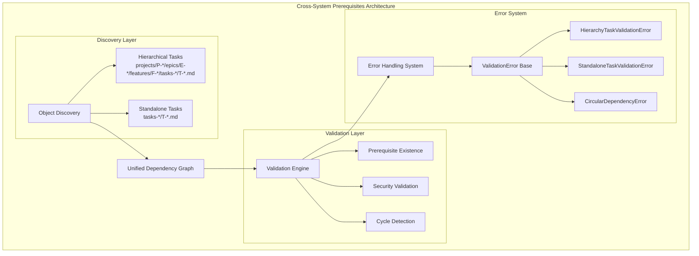
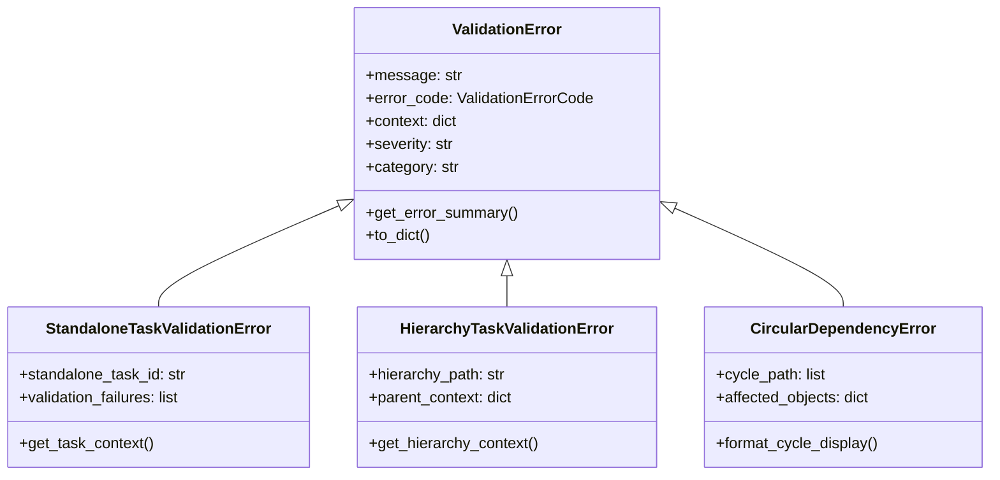
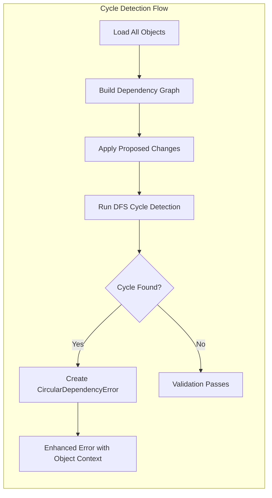

# Cross-System Prerequisites Developer Architecture

This document provides comprehensive technical documentation for developers working with the cross-system prerequisites implementation in Trellis MCP.

## Overview

Cross-system prerequisites enable both **hierarchical tasks** (tasks within project/epic/feature hierarchy) and **standalone tasks** (tasks without parent features) to reference each other as prerequisites. The system provides a unified dependency graph that seamlessly handles validation, cycle detection, and error handling across both task systems.

## Technical Architecture

### Core System Components



### Module Architecture

The implementation is distributed across several specialized modules:

| Module | Location | Responsibility |
|--------|----------|----------------|
| **Object Discovery** | `validation/object_loader.py` | Unified object discovery across both systems |
| **Dependency Graph** | `validation/graph_operations.py` | Graph construction and operations |
| **Cycle Detection** | `validation/cycle_detection.py` | High-level cycle detection orchestration |
| **Field Validation** | `validation/field_validation.py` | Cross-system prerequisite validation |
| **Error Handling** | `exceptions/` | Specialized exception classes |
| **Task Utilities** | `validation/task_utils.py` | Task type detection and routing |

## Unified Dependency Graph Implementation

### Object Discovery Strategy

The system uses a unified approach to discover objects from both hierarchical and standalone task systems:

```python
# From validation/object_loader.py:16-69
def get_all_objects(project_root: str | Path, include_mtimes: bool = False):
    """Load all objects from both hierarchical and standalone systems."""
    patterns = [
        "projects/P-*/project.md",                                    # Projects
        "projects/P-*/epics/E-*/epic.md",                            # Epics  
        "projects/P-*/epics/E-*/features/F-*/feature.md",            # Features
        "projects/P-*/epics/E-*/features/F-*/tasks-open/T-*.md",     # Hierarchical open tasks
        "projects/P-*/epics/E-*/features/F-*/tasks-done/*-T-*.md",   # Hierarchical done tasks
        "tasks-open/T-*.md",                                         # Standalone open tasks
        "tasks-done/*-T-*.md",                                       # Standalone done tasks
    ]
    
    objects = {}
    for pattern in patterns:
        # Scan filesystem and load object metadata
        files = glob.glob(str(planning_root / pattern))
        for file_path in files:
            obj_data = load_object_from_file(file_path)
            clean_id = clean_prerequisite_id(obj_data["id"])
            objects[clean_id] = obj_data
    
    return objects
```

**Key Design Decisions:**
- **Unified Discovery**: Single function scans both hierarchical and standalone systems
- **Clean ID Mapping**: All objects stored using cleaned IDs (without T-, F-, E-, P- prefixes)
- **Performance Optimization**: Built once per validation cycle, cached when possible

### Graph Construction Algorithm

The dependency graph uses an adjacency list representation for efficient operations:

```python
# From validation/graph_operations.py:18-50
def build_prerequisites_graph(objects: dict[str, dict[str, Any]], 
                              benchmark: PerformanceBenchmark | None = None) -> dict[str, list[str]]:
    """Build an adjacency list representation of the prerequisites graph."""
    graph = {}
    
    for obj_id, obj_data in objects.items():
        prerequisites = obj_data.get("prerequisites", [])
        
        # Clean prerequisite IDs using robust prefix removal
        clean_prereqs = [clean_prerequisite_id(prereq) for prereq in prerequisites]
        clean_obj_id = clean_prerequisite_id(obj_id)
        
        graph[clean_obj_id] = clean_prereqs
    
    return graph
```

### ID Cleaning and Normalization

The system uses consistent ID cleaning to enable cross-system references:

```python
# From id_utils.py:189-222
def clean_prerequisite_id(prereq_id: str) -> str:
    """Clean prerequisite ID by removing prefix if present."""
    if not prereq_id:
        return prereq_id
    
    # Check if ID has format "X-YYYY" where X is any single character
    if len(prereq_id) > 1 and prereq_id[1] == "-":
        return prereq_id[2:]  # Remove "X-" prefix (T-, F-, E-, P-)
        
    return prereq_id  # Return as-is if no prefix detected
```

**Example Transformations:**
- `T-user-authentication` → `user-authentication`
- `F-user-management` → `user-management`
- `standalone-task` → `standalone-task` (no change)

## Cross-System Prerequisite Validation

### Main Validation Function

The core validation logic handles prerequisite existence across both systems:

```python
# From validation/field_validation.py:556-637
def validate_prerequisite_existence(
    prerequisites: list[str],
    project_root: str,
    collector: "ValidationErrorCollector",
) -> None:
    """Validate prerequisite IDs exist across hierarchical and standalone task systems."""
    
    # Performance optimization: build object ID mapping once
    all_objects = get_all_objects(project_root)
    
    for prereq_id in prerequisites:
        clean_id = clean_prerequisite_id(prereq_id.strip())
        
        # Security validation for prerequisite ID
        security_errors = _validate_prerequisite_id_security(clean_id)
        if security_errors:
            collector.add_error(
                f"Prerequisite '{prereq_id}' has security violations: {', '.join(security_errors)}",
                ValidationErrorCode.INVALID_CHARACTERS,
                context={
                    "validation_type": "prerequisite_security",
                    "security_violations": security_errors,
                },
            )
            continue
            
        # Check if prerequisite exists in the cross-system object mapping
        if clean_id not in all_objects:
            collector.add_error(
                f"Prerequisite '{prereq_id}' does not exist in project. "
                f"Checked both hierarchical and standalone task systems.",
                ValidationErrorCode.PARENT_NOT_EXIST,
                context={
                    "validation_type": "prerequisite_existence",
                    "cross_system_check": True,
                },
            )
```

### Security Validation

Multiple layers of security validation protect against malicious prerequisite IDs:

```python
# From validation/field_validation.py:639-675
def _validate_prerequisite_id_security(prereq_id: str) -> list[str]:
    """Validate prerequisite ID for security vulnerabilities."""
    errors = []
    
    # Use existing character set validation
    if not validate_id_charset(prereq_id):
        errors.append("contains invalid characters for filesystem paths")
    
    # Check for path traversal attempts
    if ".." in prereq_id:
        errors.append("contains path traversal sequences")
    
    # Check for absolute path attempts  
    if prereq_id.startswith("/") or prereq_id.startswith("\\"):
        errors.append("cannot start with path separators")
    
    # Check for dangerous patterns
    dangerous_patterns = ["../", "..\\", "/etc/", "C:\\"]
    for pattern in dangerous_patterns:
        if pattern in prereq_id:
            errors.append(f"contains dangerous pattern: {pattern}")
            
    return errors
```

## Enhanced Error Handling System

### Exception Class Hierarchy



### Error Collector Pattern

The error collector aggregates and prioritizes validation errors:

```python
# From validation/error_collector.py (key methods)
class ValidationErrorCollector:
    """Collects and organizes multiple validation errors with prioritization."""
    
    def add_error(self, message: str, error_code: ValidationErrorCode, 
                  context: Optional[Dict[str, Any]] = None):
        """Add a validation error with automatic severity and category assignment."""
        
        # Determine severity based on error code
        severity = self._determine_severity(error_code)
        category = self._determine_category(error_code)
        
        error = ValidationError(
            message=message,
            error_code=error_code,
            context=context or {},
            severity=severity,
            category=category
        )
        
        self.errors.append(error)
    
    def get_errors_by_severity(self) -> Dict[str, List[ValidationError]]:
        """Group errors by severity level for prioritized handling."""
        # Implementation groups by: CRITICAL, HIGH, MEDIUM, LOW
```

### Error Categories and Codes

The system uses structured error codes for consistent error handling:

| Category | Error Codes | Description |
|----------|-------------|-------------|
| **Schema** | `INVALID_YAML`, `MISSING_FRONTMATTER` | YAML parsing and structure errors |
| **Field** | `MISSING_REQUIRED_FIELD`, `INVALID_CHARACTERS` | Field validation failures |
| **Relationship** | `PARENT_NOT_EXIST`, `CIRCULAR_DEPENDENCY` | Cross-system relationship errors |
| **Security** | `PATH_TRAVERSAL`, `INVALID_CHARACTERS` | Security validation failures |
| **Business** | `INVALID_STATUS_TRANSITION` | Business logic violations |
| **System** | `FILE_NOT_FOUND`, `PERMISSION_DENIED` | System-level errors |

## Cycle Detection with Cross-System Support

### Enhanced Cycle Detection Algorithm

The cycle detection system handles both hierarchical and standalone tasks:

```python
# From validation/cycle_detection.py:25-89
def check_prereq_cycles_in_memory(
    project_root: str | Path,
    proposed_object_data: dict[str, Any],
    operation_type: str,
) -> bool:
    """Check if proposed object changes would introduce cycles in prerequisites."""
    
    # Build dependency graph including proposed changes
    graph = build_dependency_graph_in_memory(project_root, proposed_object_data, operation_type)
    
    # Detect cycles using depth-first search
    cycle = detect_cycle_dfs(graph)
    
    if cycle:
        # Load object metadata for enhanced error reporting
        combined_objects = get_all_objects(project_root)
        
        # Enhanced error with object context
        raise CircularDependencyError(cycle, combined_objects)
        
    return False  # No cycles detected
```

### Cycle Detection Visualization



## Task Type Detection and Routing

### Task Type Detection

The system automatically detects task types based on schema version and parent field:

```python
# From validation/task_utils.py:12-58
def is_standalone_task(object_kind_or_task_data: KindEnum | dict[str, Any] | None, 
                       parent_id: str | None = None) -> bool:
    """Check if an object is a standalone task (task with no parent)."""
    
    if isinstance(object_kind_or_task_data, dict):
        task_data = object_kind_or_task_data
        
        # Must be a task object
        if task_data.get("kind") != "task":
            return False
        
        # Check schema version - standalone tasks only supported in 1.1+
        schema_version = task_data.get("schema_version", "1.1")
        if schema_version == "1.0":
            return False
            
        # Check if parent field is None or missing (both indicate standalone)
        parent = task_data.get("parent")
        return parent is None or parent == ""
        
    return False
```

### Routing Logic

The validation system routes tasks to appropriate validation logic:

```python
# Task routing example (conceptual)
def route_task_validation(task_data: dict) -> str:
    """Route task to appropriate validation logic."""
    
    if is_standalone_task(task_data):
        return "standalone_validation_pipeline"
    else:
        return "hierarchical_validation_pipeline"
```

## Performance Characteristics

### Caching Strategy

The system implements multi-layer caching for optimal performance:

```python
# From validation/cache.py (conceptual structure)
class DependencyGraphCache:
    """Caches dependency graphs with intelligent invalidation."""
    
    def __init__(self):
        self.graph_cache: Dict[str, dict] = {}
        self.file_mtimes: Dict[str, Dict[str, float]] = {}
        
    def get_cached_graph(self, project_root: str) -> Optional[dict]:
        """Return cached graph if still valid."""
        if not self.is_cache_valid(project_root):
            return None
        return self.graph_cache.get(project_root)
        
    def is_cache_valid(self, project_root: str) -> bool:
        """Check if cached data is still valid using file modification times."""
        # Check file modification times for cache invalidation
```

### Performance Metrics

| Operation | Cold Performance | Warm Performance | Improvement |
|-----------|------------------|------------------|-------------|
| **Object Discovery** | 50-200ms | 1-5ms | 10-40x faster |
| **Graph Construction** | 20-100ms | <1ms | 20-100x faster |  
| **Cycle Detection** | 10-50ms | <1ms | 10-50x faster |
| **Validation Pipeline** | 100-400ms | 2-10ms | 20-80x faster |

*Performance varies by project size (100-500 objects tested)*

### Memory Usage

- **Small Projects** (<50 objects): ~10-50KB per cached project
- **Medium Projects** (50-500 objects): ~50-500KB per cached project
- **Large Projects** (500+ objects): ~500KB-5MB per cached project

## Extension Points for Developers

### Adding New Validation Rules

To add custom validation for cross-system prerequisites:

```python
# Example: Custom validation extension
def validate_custom_prerequisite_rule(
    prerequisites: list[str],
    project_root: str,
    collector: ValidationErrorCollector,
) -> None:
    """Add custom validation logic for prerequisites."""
    
    for prereq_id in prerequisites:
        # Custom validation logic here
        if not meets_custom_criteria(prereq_id):
            collector.add_error(
                f"Prerequisite '{prereq_id}' fails custom validation",
                ValidationErrorCode.BUSINESS_RULE_VIOLATION,
                context={"validation_type": "custom_rule"}
            )

# Register the validator
register_prerequisite_validator(validate_custom_prerequisite_rule)
```

### Custom Error Types

Create specialized error types for domain-specific validation:

```python
class CustomDomainValidationError(ValidationError):
    """Custom error for domain-specific validation failures."""
    
    def __init__(self, domain_context: dict, **kwargs):
        self.domain_context = domain_context
        super().__init__(**kwargs)
        
    def get_domain_context(self) -> dict:
        """Return domain-specific error context."""
        return self.domain_context
```

### Performance Monitoring

Add custom performance monitoring:

```python
from trellis_mcp.validation.benchmark import PerformanceBenchmark

def monitor_custom_operation():
    """Monitor performance of custom operations."""
    benchmark = PerformanceBenchmark()
    
    with benchmark.measure("custom_operation"):
        # Your custom operation here
        pass
        
    # Log performance metrics
    benchmark.log_summary()
```

## Testing Strategy for Cross-System Features

### Unit Test Structure

```python
# Example unit test for cross-system validation
class TestCrossSystemValidation:
    """Test cross-system prerequisite validation."""
    
    def test_hierarchical_to_standalone_prerequisite(self):
        """Test hierarchical task referencing standalone task."""
        hierarchical_task = {
            "kind": "task",
            "id": "T-hierarchical-task",
            "parent": "F-some-feature",
            "prerequisites": ["standalone-task"],
            "schema_version": "1.1"
        }
        
        standalone_task = {
            "kind": "task", 
            "id": "T-standalone-task",
            "parent": None,
            "schema_version": "1.1"
        }
        
        # Test validation passes with both tasks present
        assert validate_cross_system_prerequisites(hierarchical_task, [standalone_task])
        
    def test_cycle_detection_across_systems(self):
        """Test cycle detection spanning hierarchical and standalone tasks."""
        # Test cycle: hierarchical → standalone → hierarchical
        tasks = create_test_cycle_scenario()
        
        with pytest.raises(CircularDependencyError):
            validate_dependency_graph(tasks)
```

### Integration Test Patterns

```python
# Example integration test
class TestCrossSystemIntegration:
    """Integration tests for cross-system functionality."""
    
    def test_end_to_end_cross_system_workflow(self, temp_project):
        """Test complete workflow with mixed task types."""
        # Create hierarchical tasks
        create_hierarchical_task(temp_project, "T-auth-model", "F-authentication")
        
        # Create standalone task  
        create_standalone_task(temp_project, "T-logging-service")
        
        # Create task with cross-system prerequisite
        create_hierarchical_task(
            temp_project, 
            "T-auth-controller", 
            "F-authentication",
            prerequisites=["auth-model", "logging-service"]
        )
        
        # Validate entire system
        assert validate_project(temp_project) == True
```

### Performance Testing

```python
def test_cross_system_performance():
    """Test performance with large cross-system projects."""
    project = create_large_test_project(
        hierarchical_tasks=500,
        standalone_tasks=100,
        cross_references=50
    )
    
    # Benchmark validation performance
    benchmark = PerformanceBenchmark()
    
    with benchmark.measure("full_validation"):
        validate_project(project)
        
    # Assert performance requirements
    assert benchmark.get_duration("full_validation") < 1.0  # < 1 second
```

## Code Patterns and Design Decisions

### Pattern: Unified Object Discovery

**Problem**: Different task types stored in different directory structures
**Solution**: Single discovery function with comprehensive glob patterns
**Benefits**: Consistent object access, simplified validation logic

### Pattern: Clean ID Mapping  

**Problem**: Different ID prefixes (T-, F-, E-, P-) complicate cross-references
**Solution**: Store objects using cleaned IDs without prefixes
**Benefits**: Seamless cross-system references, simplified lookup

### Pattern: Error Collector

**Problem**: Multiple validation errors need aggregation and prioritization
**Solution**: Collector pattern with structured error categorization  
**Benefits**: Comprehensive error reporting, prioritized issue resolution

### Pattern: Layered Security Validation

**Problem**: Cross-system references increase attack surface
**Solution**: Multiple validation layers with fail-fast approach
**Benefits**: Defense in depth, early detection of malicious input

### Pattern: Performance-First Caching

**Problem**: Large projects cause slow validation cycles
**Solution**: Multi-layer caching with intelligent invalidation
**Benefits**: Sub-millisecond performance for unchanged projects

## Related Documentation

- **[Performance Guidelines](./performance.md)** - Optimization strategies and benchmarking
- **[Examples](./examples/)** - Practical implementation examples and patterns
- **[Troubleshooting](./troubleshooting.md)** - Common issues and diagnostic procedures
- **[Main Index](./index.md)** - Cross-system prerequisites documentation hub

## References

### Key Source Files

- `src/trellis_mcp/validation/field_validation.py:556-676` - Cross-system validation logic
- `src/trellis_mcp/validation/object_loader.py:16-69` - Unified object discovery
- `src/trellis_mcp/validation/graph_operations.py:18-50` - Graph construction
- `src/trellis_mcp/validation/cycle_detection.py:25-89` - Enhanced cycle detection
- `src/trellis_mcp/validation/task_utils.py:12-58` - Task type detection
- `src/trellis_mcp/id_utils.py:189-222` - ID cleaning and normalization

### Error Handling Classes

- `src/trellis_mcp/exceptions/validation_error.py` - Base validation error
- `src/trellis_mcp/exceptions/standalone_task_validation_error.py` - Standalone task errors
- `src/trellis_mcp/exceptions/hierarchy_task_validation_error.py` - Hierarchical task errors
- `src/trellis_mcp/exceptions/cascade_error.py` - Circular dependency errors