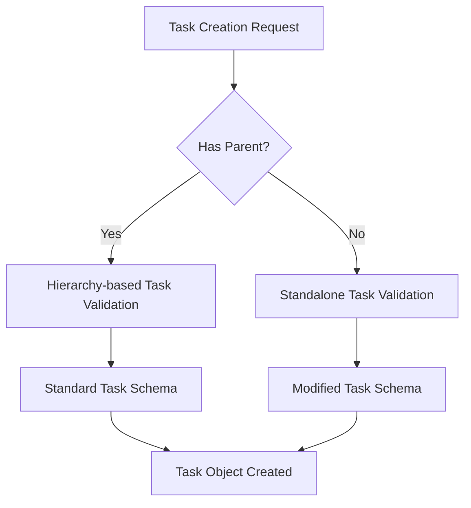

### Purpose and Goals
Modify the core Trellis schema and validation system to support standalone tasks that can exist without parent projects, epics, or features. This foundational epic enables all subsequent standalone task functionality.

### Major Components and Deliverables
- **Schema Updates**: Modify `base_schema.py` to allow tasks with null/empty parent fields
- **Validation Logic**: Update task validation to handle both standalone and hierarchy-based tasks
- **Type System**: Ensure proper typing for optional parent relationships
- **Error Handling**: Appropriate validation messages for standalone task scenarios

### Architecture Diagrams

### User Stories
- As a developer, I want to create tasks without requiring parent objects so I can quickly capture small work items
- As a system, I need to validate standalone tasks differently while maintaining consistency with existing task validation

### Success Criteria
- Tasks can be created with no parent field specified
- Validation logic correctly handles both task types
- No breaking changes to existing hierarchy-based task validation
- Schema changes support future file system modifications

### Technical Considerations
- Maintain backward compatibility with existing task schemas
- Ensure validation performance doesn't degrade
- Support clean migration path for existing validation logic

### Testing Strategy
- Unit tests for schema validation with and without parents
- Integration tests for task creation scenarios
- Regression tests for existing hierarchy-based functionality
- Edge case testing for malformed parent references

### Documentation
- Update schema documentation to reflect optional parent field
- Add validation rule documentation for standalone tasks
- Include examples of both task creation patterns

### Log

