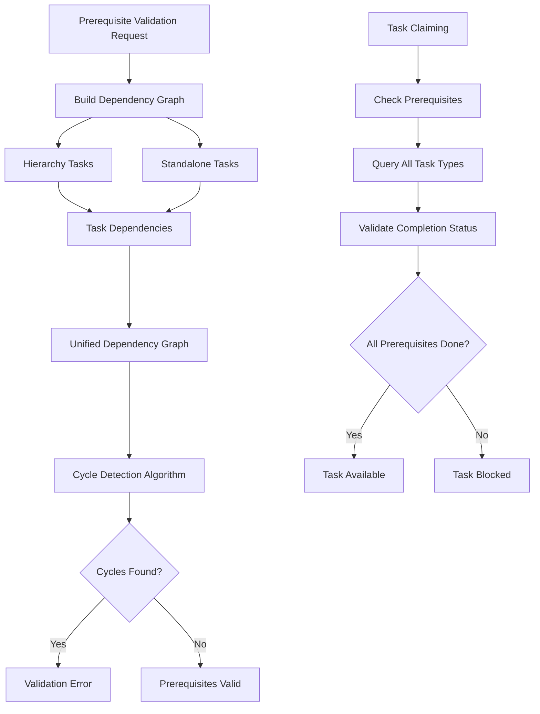
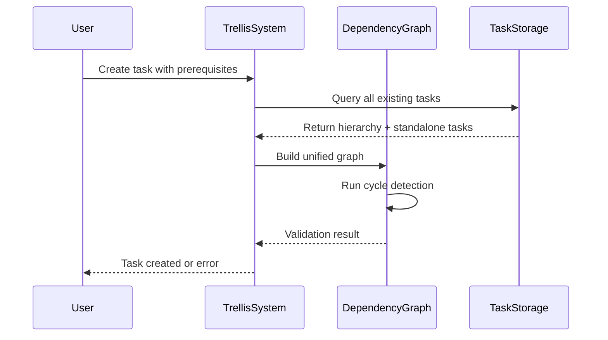

### Purpose and Goals
Enhance the prerequisite system to support dependencies between standalone tasks and hierarchy-based tasks, ensuring robust cycle detection and dependency resolution across the entire mixed task ecosystem.

### Major Components and Deliverables
- **Enhanced Prerequisite Validation**: Support prerequisites between any task types
- **Cross-System Dependency Graphs**: Build unified dependency graphs including all task types
- **Cycle Detection**: Ensure cycle detection works across standalone and hierarchy-based tasks
- **Dependency Resolution**: Update `is_unblocked()` logic for mixed task scenarios
- **Prerequisite Completion Checking**: Validate prerequisites regardless of task storage location

### Architecture Diagrams

### Data Flow Diagrams

### User Stories
- As a user, I want to set hierarchy-based tasks as prerequisites for standalone tasks so I can manage complex workflows
- As a user, I want to set standalone tasks as prerequisites for hierarchy-based tasks for maximum flexibility
- As a system, I need to prevent circular dependencies across all task types to maintain data integrity
- As a developer, I want prerequisite validation to be fast and reliable regardless of task mix

### Success Criteria
- Prerequisites work between any combination of task types
- Cycle detection prevents circular dependencies across the entire system
- Task claiming correctly respects prerequisites from all task types
- Performance remains acceptable with complex prerequisite networks

### Technical Considerations
- Build efficient algorithms for cross-system dependency traversal
- Maintain existing prerequisite validation performance characteristics
- Support complex prerequisite networks without memory overhead
- Ensure dependency resolution scales with task volume

### Dependencies on Other Epics
- **E-mcp-tool-integration**: Tool integration must be complete before cross-system prerequisites

### Non-functional Requirements
- **Performance**: Prerequisite validation should complete in <100ms for networks up to 1000 tasks
- **Scalability**: Support prerequisite networks with arbitrary depth and complexity
- **Reliability**: Zero false positives in cycle detection across mixed task types

### Estimated Scale
Approximately 6-8 features covering validation logic, graph algorithms, and integration points.

### Testing Strategy
- Unit tests for dependency graph building with mixed task types
- Algorithm tests for cycle detection across system boundaries
- Integration tests for prerequisite validation in real-world scenarios
- Performance tests with large mixed task prerequisite networks
- Edge case testing for complex prerequisite scenarios

### Documentation
- Document cross-system prerequisite capabilities and limitations
- Provide examples of effective prerequisite strategies
- Include performance guidelines for large prerequisite networks

### Log

