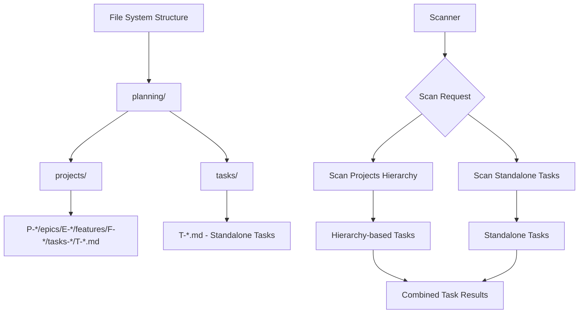

### Purpose and Goals
Implement file system support for standalone tasks by updating path resolution logic and scanner functionality. Enable tasks to be stored in `planning/tasks/` directory structure while maintaining integration with existing file discovery systems.

### Major Components and Deliverables
- **Path Resolution**: Update `path_resolver.py` for `planning/tasks/` directory structure
- **Scanner Updates**: Modify `scanner.py` to discover standalone tasks alongside hierarchy-based tasks
- **File Organization**: Implement `tasks-open` and `tasks-done` directory patterns for standalone tasks
- **Discovery Logic**: Ensure standalone tasks are found by all existing discovery mechanisms

### Architecture Diagrams

### User Stories
- As a user, I want my standalone tasks to be stored in a logical location that doesn't require creating project folders
- As the system, I need to find standalone tasks as efficiently as hierarchy-based tasks
- As a developer, I want path resolution to work seamlessly for both task storage patterns

### Success Criteria
- Standalone tasks are correctly stored in `planning/tasks/` directory
- Scanner finds standalone tasks in all discovery operations
- Path resolution works for both creation and retrieval of standalone tasks
- File organization supports future task status transitions

### Technical Considerations
- Maintain consistent file naming patterns (T-{task-id}.md)
- Ensure scanner performance doesn't degrade with additional directory scanning
- Support both immediate and subdirectory organization patterns
- Preserve existing path resolution for hierarchy-based tasks

### Dependencies on Other Epics
- **E-core-schema-validation**: Schema must support standalone tasks before file system changes

### Testing Strategy
- Unit tests for path resolution functions with standalone task scenarios
- Integration tests for scanner discovery of mixed task types
- File system tests for task creation and organization
- Performance tests to ensure scanning efficiency

### Documentation
- Update path resolution documentation
- Document new file system organization patterns
- Include examples of standalone task file structures

### Log

