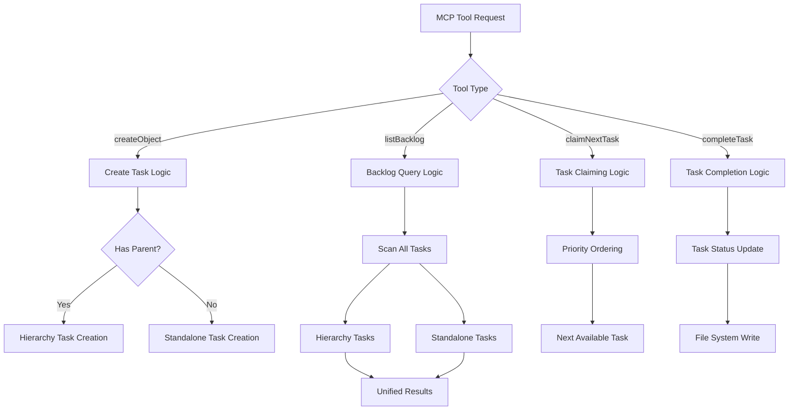

### Purpose and Goals
Update all existing MCP tools to seamlessly work with standalone tasks, ensuring full integration with the existing task management workflow. Enable users to create, manage, and complete standalone tasks using the same tools as hierarchy-based tasks.

### Major Components and Deliverables
- **createObject Tool**: Support task creation without parent validation
- **listBacklog Tool**: Include standalone tasks in backlog queries and filtering
- **claimNextTask Tool**: Consider standalone tasks in priority ordering and claiming logic
- **completeTask Tool**: Handle standalone task completion and file path resolution
- **Backlog Loader**: Update to include standalone tasks in all query results
- **Priority Ordering**: Ensure standalone and hierarchy-based tasks are prioritized together

### Architecture Diagrams

### User Stories
- As a user, I want to create standalone tasks using the same `createObject` command without specifying a parent
- As a user, I want `listBacklog` to show all my tasks regardless of whether they're standalone or hierarchy-based
- As a user, I want `claimNextTask` to give me the highest priority task available, regardless of task type
- As a user, I want to complete standalone tasks using the same `completeTask` workflow

### Success Criteria
- All existing MCP tools work seamlessly with standalone tasks
- Task creation, querying, claiming, and completion work for both task types
- Priority ordering considers standalone and hierarchy-based tasks together
- No breaking changes to existing tool interfaces or behavior

### Technical Considerations
- Maintain existing tool interfaces and parameter structures
- Ensure performance doesn't degrade with mixed task type handling
- Support all existing filtering and sorting options for standalone tasks
- Preserve backward compatibility for hierarchy-based task workflows

### Dependencies on Other Epics
- **E-file-system-path-resolution**: File system support must be complete before tool integration

### Estimated Scale
Approximately 8-12 features covering tool updates, integration points, and workflow modifications.

### Testing Strategy
- Integration tests for each MCP tool with standalone tasks
- Workflow tests for complete task lifecycle (create → claim → complete)
- Mixed scenario tests with both task types in the same operations
- Performance tests for backlog loading with large mixed task sets
- Regression tests for existing hierarchy-based functionality

### Documentation
- Update MCP tool documentation to reflect standalone task support
- Add examples of standalone task workflows
- Document mixed task type scenarios and best practices

### Log

