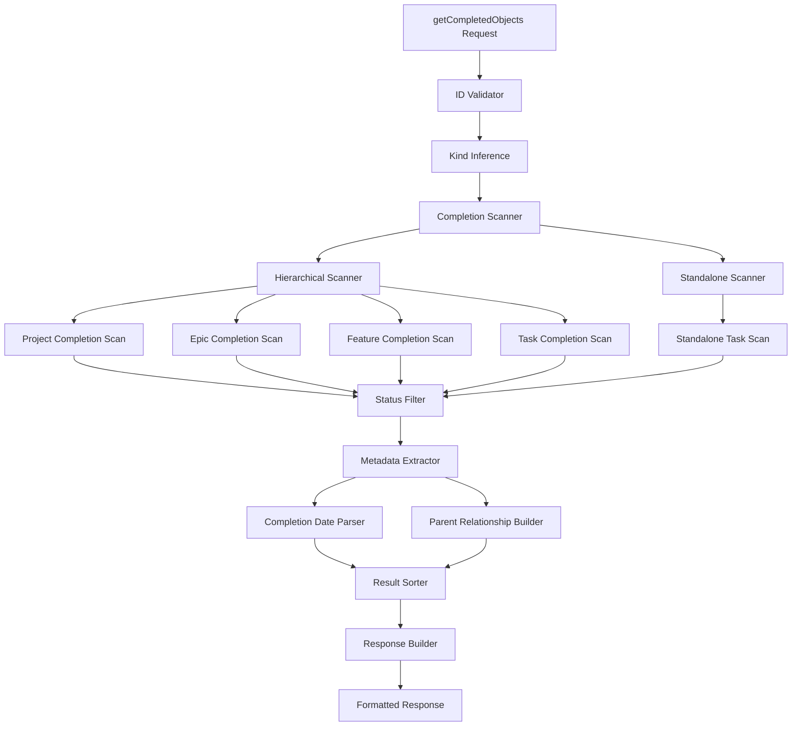
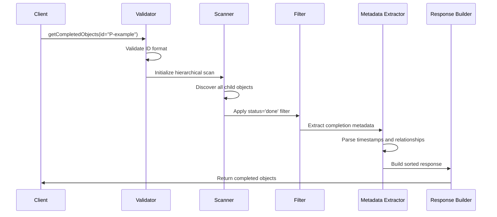
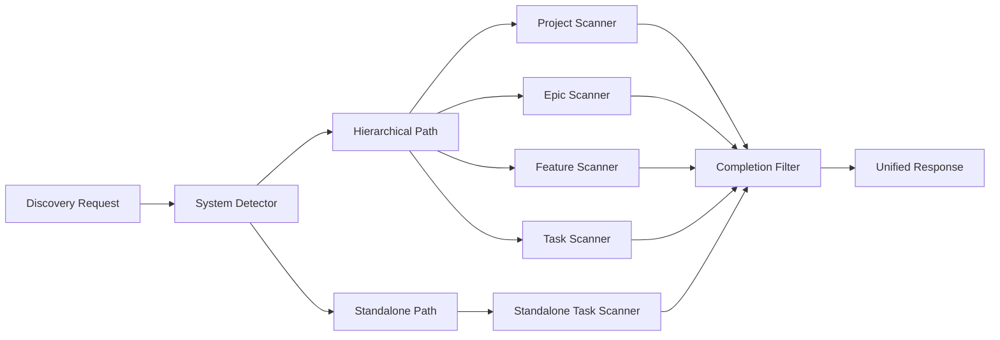

# Discovery Tools Implementation Epic

## Purpose and Goals

Implement new discovery capabilities for the Trellis MCP server, specifically the getCompletedObjects tool that enables users to find and analyze completed work within project hierarchies. This epic focuses on providing comprehensive visibility into project progress and completion status across both hierarchical and standalone task systems.

## Major Components and Deliverables

### 1. Completed Objects Discovery
- **Recursive completion scanning** to find all completed objects within hierarchy branches
- **Cross-system support** for both hierarchical and standalone completed objects
- **Rich metadata extraction** including completion dates, parent relationships, and object details
- **Performance optimized querying** with appropriate caching strategies

### 2. Completion Status Analysis
- **Status filtering logic** to identify objects with status='done'
- **Timestamp accuracy** using actual completion timestamps from object metadata
- **Parent relationship tracking** to provide context for completed objects
- **Hierarchical context preservation** for understanding completion scope

### 3. Discovery Response Formatting
- **Structured response format** with comprehensive object metadata
- **Sorted result presentation** ordered by completion date (most recent first)
- **Consistent data quality** across all discovered objects
- **Performance metrics** and result set management for large completions

## Detailed Acceptance Criteria

### getCompletedObjects Tool Implementation
- [ ] **Recursive Scanning**: Find all completed objects in hierarchy branch starting from specified ID
- [ ] **Status Filtering**: Only include objects with status='done' in results
- [ ] **Cross-System Support**: Scan both hierarchical and standalone completed objects
- [ ] **Performance Target**: Complete scanning in < 200ms for typical completion histories
- [ ] **ID Parameter**: Accept any valid object ID (P-, E-, F-, T-) as starting point

### Completion Metadata Quality
- [ ] **Complete Object Data**: Include ID, kind, title, completion date, parent for each object
- [ ] **Timestamp Accuracy**: Use actual completion timestamp from object YAML metadata
- [ ] **Parent Relationships**: Correctly identify parent object for hierarchical context
- [ ] **Kind Identification**: Accurately determine object type for each completed item
- [ ] **Data Consistency**: Ensure all returned metadata is accurate and up-to-date

### Response Format and Sorting
- [ ] **Structured Response**: Return well-defined dictionary with completed_objects array
- [ ] **Completion Date Sorting**: Order results by completion date (most recent first)
- [ ] **Tiebreaker Logic**: Use priority as secondary sort when completion dates match
- [ ] **Result Formatting**: Consistent data structure for each completed object
- [ ] **Empty Result Handling**: Graceful handling when no completed objects found

### Performance and Scalability
- [ ] **Efficient Scanning**: Optimize performance without full tree traversal for large hierarchies
- [ ] **Memory Management**: Reasonable memory footprint during scanning operations
- [ ] **Caching Strategy**: Implement appropriate caching for frequently accessed completion data
- [ ] **Large Dataset Handling**: Maintain performance with extensive completion histories
- [ ] **Cross-System Optimization**: Efficient discovery across both hierarchical and standalone systems

## Technical Architecture

## Integration Points

### With Tool Interface Simplification Epic
- **Dependency**: Requires kind inference engine for validating starting object ID
- **Shared Infrastructure**: Uses children scanning logic developed for simplified getObject
- **Consistent Patterns**: Follows same response formatting patterns as other simplified tools

### With Enhanced Task Claiming Epic
- **Performance Sharing**: Optimized scanning logic benefits both discovery and claiming operations
- **Cross-System Logic**: Shared infrastructure for handling hierarchical and standalone objects
- **Status Validation**: Consistent status checking logic across discovery and claiming tools

### With Tool Management Epic
- **Registration**: New getCompletedObjects tool must be registered with FastMCP server
- **Testing Integration**: Discovery tools must be validated alongside other tool changes
- **Documentation**: Comprehensive documentation for new discovery capabilities

## User Stories

### As a Project Manager
- I want to see all completed work within a project so that I can track progress and generate reports
- I want completion data sorted by date so that I can understand recent progress patterns
- I want to see both hierarchical and standalone completed work so that I have full visibility

### As a Team Lead
- I want to review completed work within my epic scope so that I can assess team productivity
- I want to see completion metadata so that I can understand what was accomplished and when
- I want fast discovery performance so that progress reviews don't slow down my workflow

### As a Developer
- I want to find completed tasks within a feature so that I can understand what work has been done
- I want accurate completion timestamps so that I can track actual delivery dates
- I want comprehensive completion data so that I can learn from past work patterns

## Non-Functional Requirements

### Performance Standards
- **Discovery response time**: Complete in < 200ms for typical completion histories
- **Large dataset handling**: Maintain reasonable performance with extensive completion records
- **Memory efficiency**: Optimize memory usage during scanning operations
- **Cross-system performance**: Efficient discovery across both hierarchical and standalone systems

### Data Quality Requirements
- **Completion accuracy**: 100% accurate identification of completed objects
- **Metadata completeness**: All completion metadata fields populated correctly
- **Timestamp precision**: Accurate completion date extraction from object metadata
- **Relationship integrity**: Correct parent-child relationships preserved in results

### Scalability Considerations
- **Large hierarchies**: Handle projects with 1000+ completed objects efficiently
- **Deep nesting**: Perform well with deeply nested project structures
- **Mixed systems**: Optimize for environments with both hierarchical and standalone objects
- **Concurrent access**: Support multiple simultaneous discovery requests

## Architecture Diagrams

### Completion Discovery Flow

### Cross-System Discovery Architecture

## Testing Strategy

### Unit Testing
- **Completion scanning logic**: Test recursive discovery for all object types
- **Status filtering**: Verify accurate filtering of completed vs. non-completed objects
- **Metadata extraction**: Test accurate parsing of completion dates and relationships
- **Sorting logic**: Validate completion date sorting and tiebreaker rules
- **Error conditions**: Test error handling for invalid IDs and edge cases

### Integration Testing
- **Cross-system discovery**: Test discovery across mixed hierarchical and standalone environments
- **Performance validation**: Measure actual response times under realistic conditions
- **Data consistency**: Verify accuracy of discovered completion data
- **Large dataset testing**: Test performance with extensive completion histories

### End-to-End Testing
- **Complete discovery workflows**: Test full discovery process from request to response
- **Mixed environment scenarios**: Validate discovery in complex project structures
- **Error handling**: Test error scenarios across the complete discovery stack
- **Performance under load**: Validate discovery performance with concurrent requests

## Success Metrics

### Functional Success
- [ ] **Comprehensive discovery**: Users can effectively discover completed work across all project scopes
- [ ] **Accurate metadata**: All completion information is accurate and complete
- [ ] **Performance targets**: Discovery operations complete within specified time limits
- [ ] **Cross-system coverage**: Discovery works effectively across both hierarchical and standalone systems

### Quality Success
- [ ] **Data integrity**: All discovered completion data is accurate and consistent
- [ ] **Error handling**: Clear, actionable error messages for all failure scenarios
- [ ] **Performance reliability**: Consistent performance across different project sizes and structures
- [ ] **Documentation quality**: Complete documentation with examples and usage patterns

### User Experience Success
- [ ] **Intuitive interface**: Discovery tool is easy to understand and use
- [ ] **Useful responses**: Discovery results provide actionable insights into project progress
- [ ] **Fast responses**: Users experience responsive discovery performance
- [ ] **Comprehensive coverage**: Users can discover all relevant completed work

This epic provides powerful discovery capabilities that enable users to gain comprehensive visibility into project progress and completion status, supporting better project management and progress tracking across the entire Trellis system.

### Log

