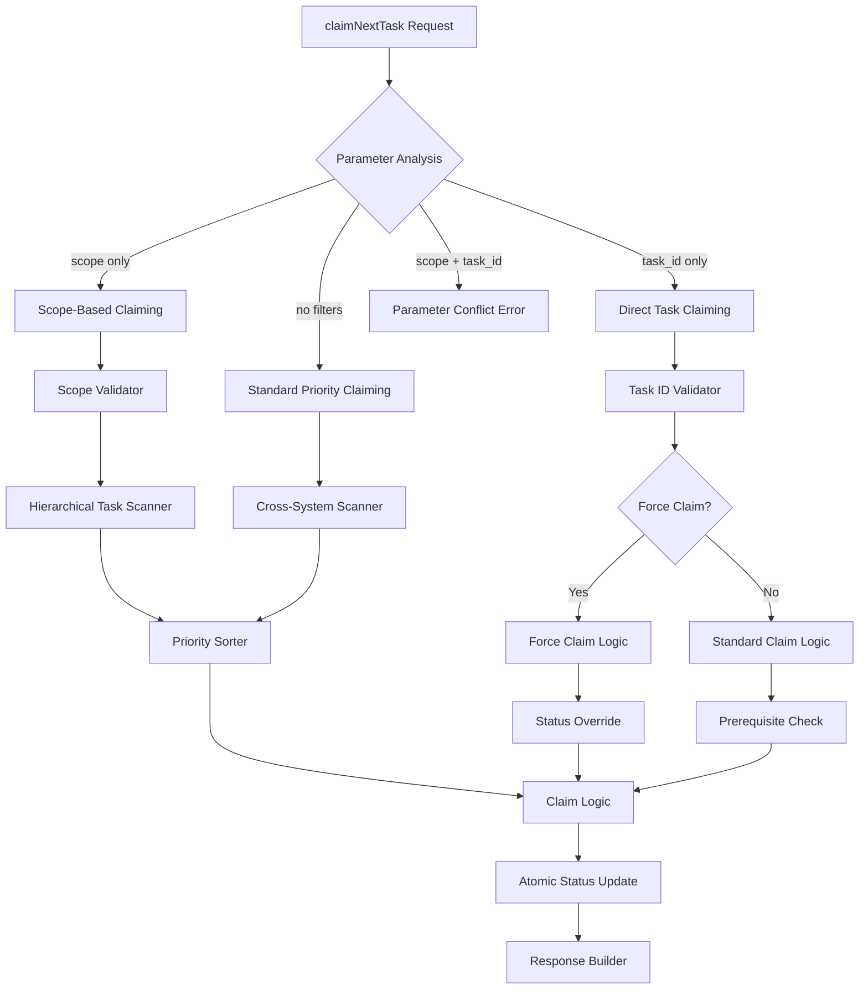
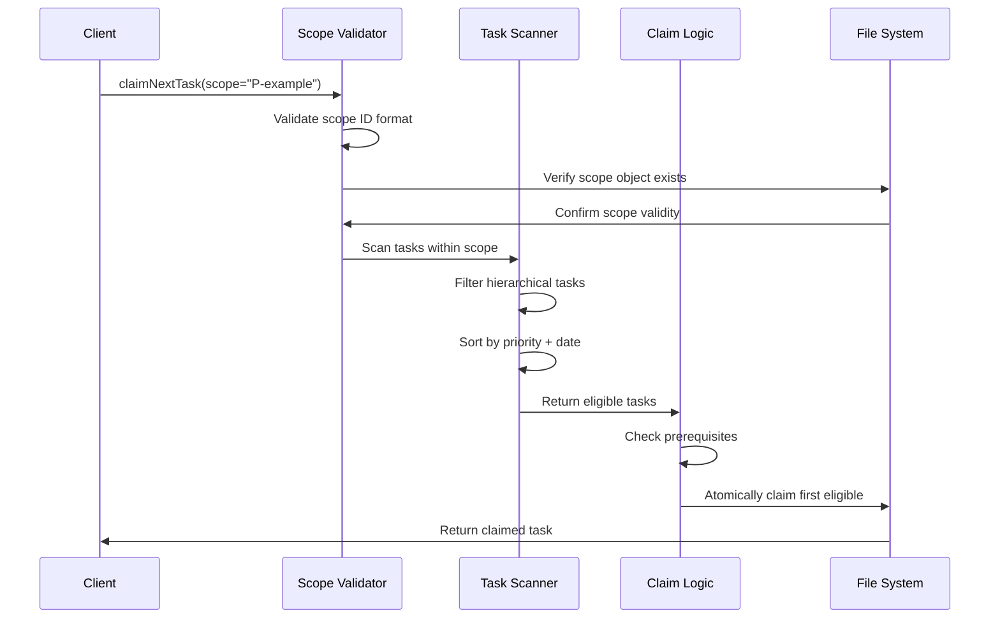
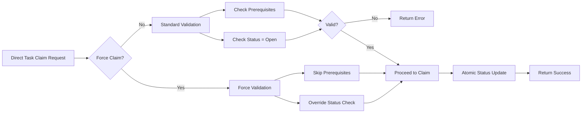

# Enhanced Task Claiming Epic

## Purpose and Goals

Enhance the claimNextTask tool with flexible filtering capabilities and direct task claiming options. This epic adds scope-based filtering to claim tasks within specific project boundaries and implements force-claim functionality for direct task acquisition, providing more control and flexibility in task management workflows. Do not write any performance requirements or testing in the features for this epic.

## Major Components and Deliverables

### 1. Scope-Based Task Filtering
- **Hierarchical scope filtering** to limit task claiming to specific project/epic/feature boundaries
- **Cross-system compatibility** with both hierarchical and standalone task systems
- **Validation and error handling** for invalid scope parameters

### 2. Direct Task Claiming
- **Specific task claiming** by task ID with optional force override
- **Prerequisite bypass logic** for force claim scenarios
- **Status override capabilities** to claim in-progress, review, or completed tasks
- **Atomic claiming operations** with conflict detection and resolution

### 3. Enhanced Parameter Logic
- **Parameter interaction rules** to prevent conflicting filter combinations
- **Backward compatibility** preservation for existing claiming workflows
- **Intelligent defaults** to maintain current priority-based behavior when no filters applied
- **Comprehensive validation** for all parameter combinations

## Detailed Acceptance Criteria

### Scope Filtering Implementation
- [ ] **Scope Parameter Validation**: Accept P-, E-, F- prefixed IDs only for scope filtering
- [ ] **Hierarchical Task Discovery**: Only return tasks that are children (direct or indirect) of scope object
- [ ] **Cross-System Support**: Work with both hierarchical and standalone tasks (scope filter won't apply to standalone)
- [ ] **Error Handling**: Return meaningful errors for invalid scope IDs with clear guidance

### Direct Task Claiming
- [ ] **Task ID Parameter**: Accept T- prefixed task IDs or standalone task IDs for direct claiming
- [ ] **Force Claim Logic**: Skip prerequisite validation when force_claim=True
- [ ] **Status Override**: Allow claiming in-progress, review, or done tasks when force_claim=True
- [ ] **Atomic Operations**: Update task status to in-progress atomically to prevent race conditions
- [ ] **Conflict Detection**: Handle concurrent claiming attempts gracefully with clear error messages
- [ ] **Validation**: Return specific error if task_id doesn't exist in either hierarchical or standalone systems

### Parameter Interaction Rules
- [ ] **Mutual Exclusivity**: Return error if both scope and task_id specified in same request
- [ ] **Force Claim Scope**: force_claim parameter only applies when task_id is specified
- [ ] **Backward Compatibility**: When no filters applied, maintain existing priority-based claiming behavior
- [ ] **Default Behavior**: Preserve current sorting (priority, then creation date) for unfiltered requests
- [ ] **Parameter Validation**: Comprehensive validation for all parameter combinations with clear error messages

### Enhanced Error Handling
- [ ] **Parameter Validation**: Clear messages for invalid scope, task_id, or ID formats
- [ ] **Permission Errors**: Informative messages when force_claim operations fail due to business rules
- [ ] **Not Found Errors**: Specific messages distinguishing object not found vs. access denied
- [ ] **Conflict Resolution**: Clear guidance when operations conflict (e.g., task already claimed)
- [ ] **Cross-System Validation**: Validate parameters across hierarchical and standalone task systems

## Technical Architecture

## Integration Points

### With Tool Interface Simplification Epic
- **Dependency**: Requires kind inference engine for validating scope and task_id parameters
- **Shared Logic**: Uses simplified object validation for parameter checking
- **Error Handling**: Consistent error message formats across all enhanced tools

### With Discovery Tools Epic
- **Cross-System Support**: Shared infrastructure for handling hierarchical and standalone tasks
- **Data Consistency**: Ensures claiming operations don't interfere with discovery tools

### With Tool Management Epic
- **Testing Coordination**: Enhanced claiming must be validated before legacy tools are removed
- **Interface Consistency**: Maintains consistent tool interface patterns across the project
- **Migration Support**: Ensures smooth transition from existing claiming workflows

## User Stories

### As a Developer Working on Large Projects
- I want to claim tasks only within my assigned epic so that I stay focused on my work area
- I want to claim tasks within a specific feature scope so that I can work on related functionality together

### As a Project Manager
- I want to be able to force-claim specific tasks so that I can reassign work when priorities change
- I want to claim tasks that are already in progress so that I can redistribute workload when needed
- I want clear error messages so that I understand why claiming operations fail

### As a System Integrator
- I want backward compatibility so that existing claiming workflows continue working unchanged
- I want consistent error handling so that I can build reliable automation around task claiming
- I want atomic operations so that concurrent systems don't interfere with each other

## Non-Functional Requirements

### Reliability Requirements
- **Atomic claiming**: Either complete successfully or fail cleanly with no partial state
- **Conflict resolution**: Handle race conditions gracefully when multiple clients claim simultaneously
- **Data integrity**: Ensure task state remains consistent across all claiming operations
- **Error recovery**: Clear rollback procedures for failed claiming operations

## Architecture Diagrams

### Scope-Based Claiming Flow

### Force Claim Logic

## Testing Strategy

### Unit Testing
- **Parameter validation**: Test all claimNextTask parameter combinations and edge cases
- **Scope filtering logic**: Verify correct task filtering for different scope types
- **Force claim scenarios**: Test override logic with various task states and prerequisites
- **Error conditions**: Comprehensive testing of all error paths and conflict scenarios

### Integration Testing
- **Cross-system claiming**: Test scope filtering across hierarchical and standalone tasks
- **Concurrent operations**: Simulate multiple clients claiming tasks simultaneously
- **Data consistency**: Verify system integrity after various claiming operations

### End-to-End Testing
- **Complete workflows**: Test full claiming workflows from request to task assignment
- **Mixed environments**: Validate claiming in projects with both hierarchical and standalone tasks
- **Error scenarios**: Test error handling across the complete system stack
- **Migration compatibility**: Ensure existing claiming workflows continue working

## Success Metrics

### Functional Success
- [ ] **Enhanced claiming capabilities**: Users can efficiently filter and claim tasks using scope and direct methods
- [ ] **Conflict resolution**: Robust handling of concurrent claiming attempts
- [ ] **Parameter flexibility**: Intuitive parameter combinations with clear validation

### Quality Success
- [ ] **Zero regressions**: Existing claiming functionality continues working without changes
- [ ] **Comprehensive error handling**: Clear, actionable error messages for all failure scenarios
- [ ] **Data integrity**: No task state corruption or inconsistencies during enhanced claiming
- [ ] **Documentation complete**: Full documentation with examples and usage patterns

This epic significantly enhances task claiming capabilities while maintaining system reliability and backward compatibility, providing users with more control and flexibility in their task management workflows.

### Log

