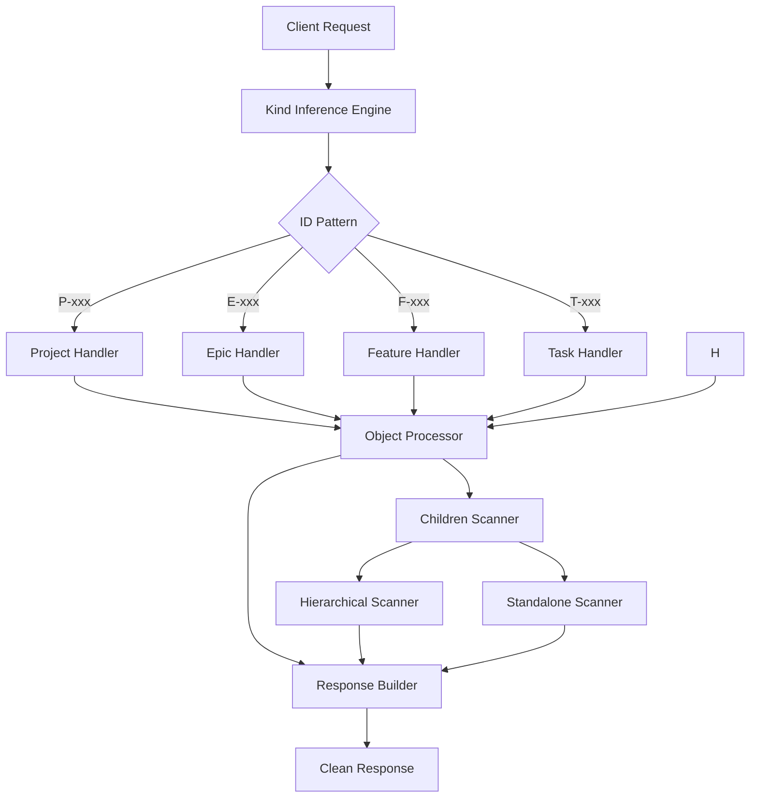

# Tool Interface Simplification Epic

## Purpose and Goals

Simplify and streamline the existing MCP tool interfaces by removing unnecessary complexity, inferring parameters automatically, and enhancing response formats. This epic focuses on making the tools more intuitive and easier to use while maintaining full backward compatibility.

## Major Components and Deliverables

### 1. Kind Inference Engine
- **Automatic object type detection** from ID prefixes (P-, E-, F-, T-)
- **Pattern matching system** for recognizing hierarchical and standalone objects
- **Validation layer** to ensure inferred types match actual object structures
- **Error handling** for unrecognized or malformed IDs

### 2. Enhanced Object Tool Interfaces
- **Simplified getObject tool** with automatic kind inference
- **Simplified updateObject tool** with automatic kind inference
- **Children discovery system** for listing immediate child objects
- **Clean response formats** without internal file_path exposure

### 3. Response Format Enhancement
- **Remove file_path** from getObject and updateObject responses
- **Add children listing** to getObject responses with efficient scanning
- **Consistent data structures** across all simplified tools
- **Performance optimized** scanning without full tree traversal

## Detailed Acceptance Criteria

### Kind Inference Engine
- [ ] **ID Pattern Recognition**: Correctly identify object types from prefixes:
  - P- → project
  - E- → epic  
  - F- → feature
  - T- → task (hierarchical and standalone)
- [ ] **Cross-System Support**: Handle both hierarchical and standalone object patterns
- [ ] **Validation**: Verify inferred kind matches actual object type in filesystem
- [ ] **Error Handling**: Return clear, actionable errors for unrecognized ID patterns
- [ ] **Performance**: Kind inference completes in < 10ms for all ID types

### getObject Tool Simplification
- [ ] **Parameter Reduction**: Remove `kind` parameter, keep only `id` and `projectRoot`
- [ ] **Automatic Inference**: Use kind inference engine to determine object type
- [ ] **Children Discovery**: Include immediate child object IDs in response
- [ ] **Clean Response**: Remove `file_path` from response dictionary
- [ ] **Enhanced Metadata**: Add inferred `kind` field to response
- [ ] **Performance**: Complete in < 50ms for objects with moderate child counts

### updateObject Tool Simplification  
- [ ] **Parameter Reduction**: Remove `kind` parameter, keep only `id` and `projectRoot`
- [ ] **Automatic Inference**: Use kind inference engine to determine object type
- [ ] **Clean Response**: Remove `file_path` from response dictionary
- [ ] **Backward Compatibility**: Ensure existing clients handle missing file_path gracefully
- [ ] **Atomicity**: All updates either complete fully or roll back cleanly

### Children Discovery System
- [ ] **Immediate Children Only**: Return direct child objects, not recursive
- [ ] **Cross-System Compatibility**: Include both hierarchical and standalone children
- [ ] **Efficient Scanning**: Optimize performance without full tree traversal
- [ ] **Sorted Results**: Return children in consistent order (by creation date)
- [ ] **Type Safety**: Correctly identify child object types for mixed hierarchies

## Technical Architecture

## Success Metrics

### Functional Success
- [ ] **Kind inference accuracy**: 100% correct inference for valid ID patterns
- [ ] **Response time targets**: All operations meet specified performance requirements
- [ ] **Children discovery**: Accurate and complete child enumeration
- [ ] **Clean interfaces**: Simplified tools provide intuitive, easy-to-use interfaces

### Quality Success
- [ ] **Zero regressions**: No existing functionality broken by simplifications
- [ ] **Comprehensive testing**: Full test coverage for all simplified functionality
- [ ] **Error handling**: Clear, actionable error messages for all failure scenarios
- [ ] **Documentation**: Complete documentation with examples and migration guidance

This epic establishes the foundation for simplified, more intuitive MCP tool interfaces while maintaining full system integrity and backward compatibility.

### Log

