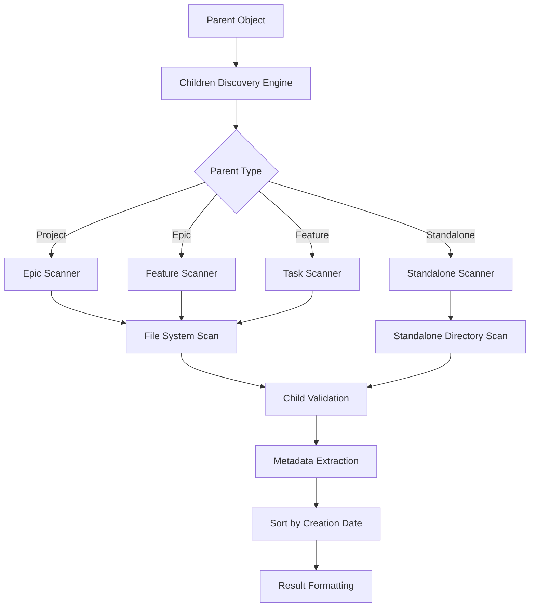

# Children Discovery System Feature

## Purpose and Functionality

Implement a children discovery system that efficiently finds and lists immediate child objects for any given parent object, supporting both hierarchical and standalone object structures. This feature enhances the getObject tool with comprehensive child enumeration capabilities while maintaining optimal performance.

## Key Components to Implement

### 1. Hierarchical Children Scanner
- **Project children discovery** for epics within projects
- **Epic children discovery** for features within epics  
- **Feature children discovery** for tasks within features
- **Performance optimized scanning** without full tree traversal
- **Sorted result generation** by creation date

### 2. Cross-System Children Support
- **Mixed environment handling** for projects with both hierarchical and standalone objects
- **Standalone task discovery** where applicable
- **Type-aware scanning** using kind inference for child identification
- **Relationship validation** to ensure parent-child consistency
- **Edge case handling** for orphaned or misplaced objects

### 3. Discovery Response Integration
- **getObject enhancement** with children array in response
- **Efficient result formatting** with minimal overhead
- **Metadata consistency** across discovered children
- **Error handling** for discovery failures
- **Cache integration** for frequently accessed parent objects

### 4. Performance Optimization
- **Targeted scanning** avoiding unnecessary directory traversal
- **Lazy evaluation** for large child collections
- **Memory efficient** processing of child lists
- **Concurrent safety** for multi-threaded access
- **Cache strategy** for repeated discovery operations

## Detailed Acceptance Criteria

### Hierarchical Children Discovery
- [ ] **Project → Epic Discovery**: List all epics within a given project
- [ ] **Epic → Feature Discovery**: List all features within a given epic
- [ ] **Feature → Task Discovery**: List all tasks within a given feature
- [ ] **Direct Children Only**: Return immediate children, not recursive descendants
- [ ] **Type Validation**: Verify child objects are of expected types

### Cross-System Compatibility
- [ ] **Mixed Environment Support**: Handle projects with both hierarchical and standalone objects
- [ ] **Standalone Task Inclusion**: Include standalone tasks where applicable for parent object context
- [ ] **Type Safety**: Correctly identify child object types using kind inference
- [ ] **Relationship Integrity**: Validate parent-child relationships are consistent
- [ ] **Error Resilience**: Handle missing or corrupted child objects gracefully

### Performance Requirements
- [ ] **Efficient Scanning**: Complete discovery in < 100ms for typical parent objects
- [ ] **Memory Optimization**: Reasonable memory footprint during scanning operations
- [ ] **No Full Traversal**: Avoid scanning entire project tree for child discovery
- [ ] **Concurrent Access**: Support multiple simultaneous discovery requests
- [ ] **Cache Integration**: Leverage caching for frequently accessed parent objects

### Result Quality and Consistency
- [ ] **Sorted Results**: Return children ordered by creation date (oldest first)
- [ ] **Complete Metadata**: Include object ID, title, status, and type for each child
- [ ] **Consistent Format**: Uniform result structure across all parent types
- [ ] **Empty Result Handling**: Graceful handling when parent has no children
- [ ] **Error Information**: Clear error messages for discovery failures

## Technical Requirements

### Discovery Architecture

### Scanning Strategy
- **Path Construction**: Build appropriate child directory paths based on parent type
- **File System Access**: Efficient directory scanning with minimal I/O operations
- **Object Validation**: Verify discovered objects are valid Trellis objects
- **Metadata Parsing**: Extract essential metadata without full object loading
- **Type Inference**: Use kind inference for child object type determination

### Integration Points
- **getObject Enhancement**: Seamless integration with simplified getObject tool
- **Kind Inference**: Leverage kind inference engine for parent and child type determination
- **Error Handling**: Consistent error propagation with other tool simplification features
- **Cache Layer**: Integration with performance caching strategies

## Implementation Guidance

### Core Discovery Algorithm
1. **Validate Parent**: Confirm parent object exists and determine type
2. **Build Child Paths**: Construct appropriate directory paths for potential children
3. **Scan Directories**: Efficiently scan child directories for valid objects
4. **Validate Children**: Verify discovered objects are valid and properly formatted
5. **Extract Metadata**: Parse essential information from child objects
6. **Sort Results**: Order children by creation date for consistent output
7. **Format Response**: Structure results for integration with getObject response

### Performance Optimization Strategies
- **Targeted Scanning**: Only scan directories where children are expected
- **Metadata Caching**: Cache child metadata to avoid repeated parsing
- **Lazy Loading**: Load child details only when needed
- **Batch Processing**: Process multiple children efficiently
- **Early Termination**: Stop scanning when maximum children reached (if applicable)

### Error Handling Approach
- **Missing Parent**: Clear error when parent object doesn't exist
- **Invalid Parent Type**: Specific error for unsupported parent types
- **File System Errors**: Graceful handling of permission or access issues
- **Corrupted Children**: Skip corrupted child objects with warnings
- **Partial Results**: Return partial results when some children are inaccessible

## Testing Requirements

### Unit Testing
- [ ] **Parent Type Handling**: Test discovery for all supported parent types (Project, Epic, Feature)
- [ ] **Empty Results**: Verify correct handling when parent has no children
- [ ] **Mixed Collections**: Test parents with both valid and invalid children
- [ ] **Performance**: Validate discovery operations meet response time requirements
- [ ] **Error Conditions**: Test all error scenarios and edge cases

### Integration Testing
- [ ] **getObject Integration**: Verify seamless integration with simplified getObject tool
- [ ] **Cross-System Discovery**: Test discovery in mixed hierarchical/standalone environments
- [ ] **Large Collections**: Test performance with parents having many children
- [ ] **Concurrent Access**: Validate thread safety with multiple simultaneous discoveries
- [ ] **Cache Integration**: Test caching effectiveness and consistency

### End-to-End Testing
- [ ] **Complete Workflows**: Test discovery as part of complete object navigation workflows
- [ ] **Real Project Structures**: Validate discovery with realistic project hierarchies
- [ ] **Error Recovery**: Test error handling in complete discovery workflows
- [ ] **Performance Under Load**: Validate discovery performance with concurrent requests

## Security Considerations

### Access Control
- **Permission Respect**: Honor existing file system permissions for child directories
- **Path Safety**: Ensure child discovery stays within project boundaries
- **Information Disclosure**: Avoid exposing sensitive file system details
- **Error Security**: Prevent error messages from revealing internal structure

### Data Integrity
- **Child Validation**: Verify child objects are legitimate Trellis objects
- **Metadata Safety**: Safely parse child metadata without code execution risks
- **Relationship Integrity**: Validate parent-child relationships are consistent
- **State Consistency**: Ensure discovery doesn't modify any object state

## Performance Requirements

### Response Time Targets
- **Small Collections**: < 50ms for parents with 1-10 children
- **Medium Collections**: < 100ms for parents with 11-50 children
- **Large Collections**: < 200ms for parents with 51+ children
- **Error Cases**: < 10ms for error detection and response generation

### Resource Optimization
- **Memory Efficiency**: Process child collections without loading entire objects into memory
- **File System Access**: Minimize file system operations through efficient scanning
- **Cache Utilization**: Leverage caching for frequently accessed parent-child relationships
- **Concurrent Safety**: Support multiple discovery operations without resource conflicts

### Scalability Considerations
- **Large Hierarchies**: Maintain performance with deeply nested project structures
- **Many Children**: Handle parents with extensive child collections efficiently
- **Concurrent Discovery**: Support multiple simultaneous discovery requests
- **Mixed Environments**: Optimize performance for projects with both hierarchical and standalone objects

## Success Metrics

### Functional Success
- [ ] **Complete Discovery**: Successfully discover all immediate children for any valid parent
- [ ] **Cross-System Support**: Effective discovery across both hierarchical and standalone object types
- [ ] **Performance Targets**: All discovery operations complete within specified time limits
- [ ] **Integration Success**: Seamless integration with getObject tool enhancement

### Quality Success
- [ ] **Data Accuracy**: All discovered children are valid and correctly identified
- [ ] **Error Handling**: Clear, actionable error messages for all failure scenarios
- [ ] **Performance Consistency**: Reliable performance across different parent types and collection sizes
- [ ] **Documentation Quality**: Clear usage examples and integration guidance

### Developer Experience Success
- [ ] **Intuitive Results**: Discovery results are easy to understand and use
- [ ] **Debugging Support**: Error messages and logging facilitate troubleshooting
- [ ] **Integration Ease**: Simple integration with existing object navigation workflows
- [ ] **Performance Predictability**: Consistent performance characteristics for capacity planning

This feature provides powerful navigation capabilities for the Trellis object hierarchy while maintaining optimal performance and supporting the project's goal of simplified, intuitive tool interfaces.

### Log

