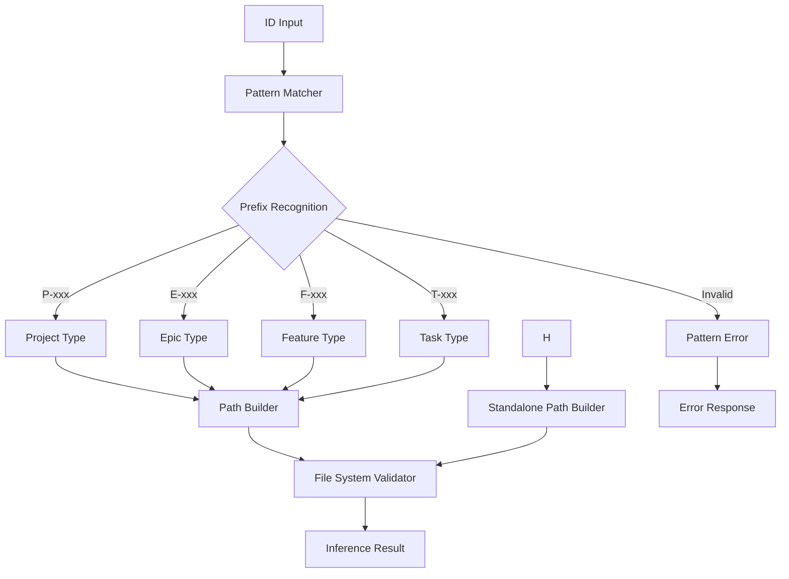

# Kind Inference Engine Feature

## Purpose and Functionality

Implement a robust kind inference engine that automatically detects object types from ID prefixes, eliminating the need for explicit `kind` parameters in tool calls. This feature provides the foundational pattern matching and validation logic required for simplified tool interfaces.

## Key Components to Implement

### 1. ID Pattern Recognition System
- **Prefix pattern matcher** for hierarchical objects (P-, E-, F-, T-)
- **Standalone pattern matcher** for standalone tasks (T-)
- **Pattern validation logic** to ensure ID format correctness
- **Error handling** for malformed or unrecognized ID patterns

### 2. Object Type Validation
- **File system validation** to verify inferred types match actual objects
- **Cross-system compatibility** for both hierarchical and standalone objects
- **Type consistency checking** to ensure inference accuracy
- **Performance optimization** for repeated validation calls

### 3. Inference Engine API
- **Core inference function** with < 10ms performance target
- **Validation integration** for type verification
- **Error handling system** with clear, actionable error messages
- **Caching layer** for frequently accessed ID patterns

## Detailed Acceptance Criteria

### ID Pattern Recognition
- [ ] **Hierarchical Prefixes**: Correctly identify P- → project, E- → epic, F- → feature, T- → task
- [ ] **Standalone Prefixes**: Correctly identify T- → standalone task
- [ ] **Pattern Validation**: Reject malformed IDs with clear error messages
- [ ] **Case Sensitivity**: Handle both uppercase and lowercase prefix patterns
- [ ] **Edge Cases**: Handle edge cases like empty strings, special characters, numeric-only IDs

### Cross-System Object Support
- [ ] **Hierarchical Path Resolution**: Map inferred types to correct hierarchical file paths
- [ ] **Standalone Path Resolution**: Map standalone task IDs to correct standalone file paths
- [ ] **Mixed Environment Support**: Work correctly in projects with both hierarchical and standalone objects
- [ ] **Path Validation**: Verify that inferred paths correspond to actual files
- [ ] **Error Specificity**: Distinguish between "invalid ID format" vs "object not found" errors

### Performance and Reliability
- [ ] **Response Time**: Complete inference in < 10ms for all ID types
- [ ] **Memory Efficiency**: Minimal memory footprint for pattern matching operations
- [ ] **Thread Safety**: Safe for concurrent access from multiple threads
- [ ] **Caching Strategy**: Implement LRU cache for recently inferred patterns
- [ ] **Error Recovery**: Graceful handling of file system access errors

### Validation Integration
- [ ] **Type Verification**: Verify inferred kind matches actual object type in filesystem
- [ ] **File Existence Check**: Confirm object file exists at inferred path
- [ ] **Metadata Consistency**: Validate object YAML metadata matches inferred type
- [ ] **Cross-Reference Validation**: Ensure object relationships are consistent with inferred types
- [ ] **Rollback Safety**: Provide safe fallback when validation fails

## Technical Requirements

### Architecture Design

### Implementation Approach
- **Pattern Matching**: Use regex patterns for robust ID prefix detection
- **Path Resolution**: Implement separate path builders for hierarchical vs standalone objects
- **Validation Layer**: Integrate file system checks with inference logic
- **Error Handling**: Provide detailed error messages with correction suggestions
- **Performance Optimization**: Use compiled regex patterns and LRU caching

### Integration Points
- **Tool Integration**: Seamless integration with getObject and updateObject tools
- **Error Propagation**: Consistent error handling across all tool interfaces
- **Type System**: Integration with existing Trellis type definitions
- **Validation Pipeline**: Compatible with existing object validation logic

## Implementation Guidance

### Core Algorithm
1. **Parse ID**: Extract and normalize the input ID string
2. **Match Pattern**: Apply regex patterns to identify object type
3. **Build Path**: Construct appropriate file path based on inferred type
4. **Validate**: Verify object exists and type matches
5. **Return Result**: Provide inferred type or detailed error

### Error Handling Strategy
- **Invalid Format**: Clear message with expected format examples
- **Object Not Found**: Specific message indicating missing file
- **Type Mismatch**: Detailed explanation of type inconsistency
- **System Errors**: Graceful handling of file system access issues

### Testing Requirements
- **Unit Tests**: Comprehensive coverage of all ID patterns and edge cases
- **Integration Tests**: Validation with real project structures
- **Performance Tests**: Verify response time requirements under load
- **Error Path Tests**: Validate all error conditions and messages

## Security Considerations

### Input Validation
- **ID Sanitization**: Prevent path traversal attacks through malicious IDs
- **Pattern Validation**: Ensure regex patterns are secure and performant
- **Path Safety**: Validate that constructed paths stay within project boundaries
- **Access Control**: Respect existing file system permissions

### Error Information
- **Information Disclosure**: Avoid exposing sensitive file system details in errors
- **Error Consistency**: Provide consistent error formats without revealing internal structure
- **Logging Safety**: Log inference attempts without exposing sensitive data

## Performance Requirements

### Response Time Targets
- **Inference Operation**: < 10ms for pattern matching and path construction
- **Validation Check**: < 20ms additional for file system validation
- **Cache Hit**: < 1ms for cached inference results
- **Error Generation**: < 5ms for error response creation

### Scalability Considerations
- **Concurrent Access**: Support multiple simultaneous inference requests
- **Memory Usage**: Maintain reasonable memory footprint for cache and patterns
- **Cache Management**: Efficient LRU cache with configurable size limits
- **Pattern Compilation**: Pre-compile regex patterns for optimal performance

## Success Metrics

### Functional Success
- [ ] **Pattern Accuracy**: 100% correct inference for valid ID formats
- [ ] **Error Clarity**: Clear, actionable error messages for all failure cases
- [ ] **Cross-System Support**: Seamless operation across hierarchical and standalone objects
- [ ] **Integration Readiness**: Ready for integration with simplified tool interfaces

### Performance Success
- [ ] **Response Time**: All operations complete within specified time limits
- [ ] **Memory Efficiency**: Reasonable memory usage for pattern matching and caching
- [ ] **Concurrent Safety**: No race conditions or data corruption under concurrent access
- [ ] **Cache Effectiveness**: High cache hit rates for repeated inference operations

This feature establishes the foundational infrastructure for automatic object type detection, enabling the simplified tool interfaces that eliminate the need for explicit kind parameters while maintaining full system reliability and performance.

### Log

