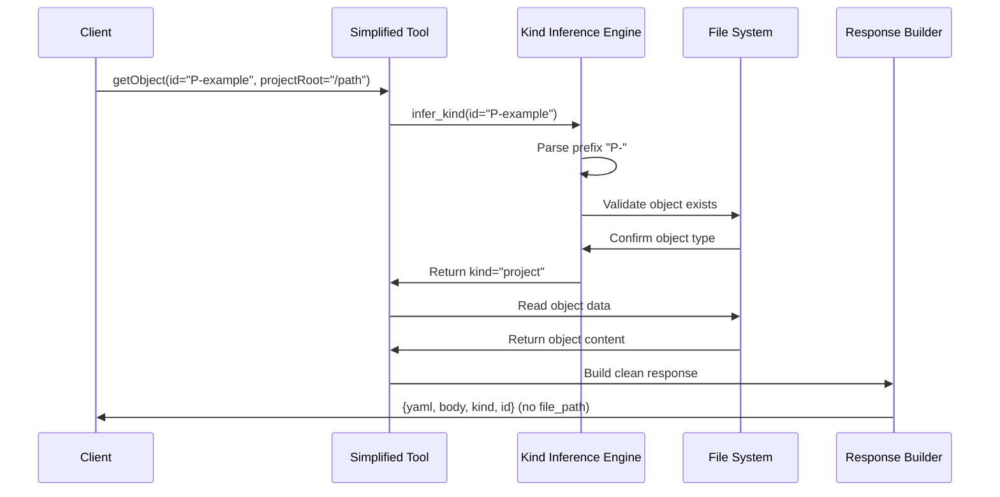

# Object Tool Simplification Feature

## Purpose and Functionality

Simplify the getObject and updateObject tools by removing the `kind` parameter and using automatic kind inference, while removing `file_path` from responses to create cleaner, more intuitive interfaces. This feature directly implements the simplified tool signatures using the kind inference engine.

## Key Components to Implement

### 1. Simplified getObject Tool
- **Parameter reduction** from (kind, id, projectRoot) to (id, projectRoot)
- **Automatic kind inference** integration using the kind inference engine
- **Clean response format** without internal file_path exposure
- **Enhanced metadata** with inferred kind field in response
- **Backward compatibility** maintenance for existing clients

### 2. Simplified updateObject Tool
- **Parameter reduction** from (kind, id, projectRoot, ...) to (id, projectRoot, ...)
- **Automatic kind inference** integration for object type determination
- **Clean response format** without internal file_path exposure
- **Atomic operations** ensuring all updates complete fully or roll back cleanly
- **Backward compatibility** preservation for existing update workflows

### 3. Tool Interface Registration
- **FastMCP registration** updates for simplified tool signatures
- **Parameter validation** using Pydantic Field annotations
- **Error handling** integration with kind inference error responses
- **Tool metadata** updates with enhanced descriptions and examples

### 4. Response Format Enhancement
- **file_path removal** from all response dictionaries
- **Enhanced metadata** including inferred kind in responses
- **Consistent structure** across both simplified tools
- **Clean data contracts** for client integration

## Detailed Acceptance Criteria

### getObject Tool Simplification
- [ ] **Parameter Signature**: Update to `getObject(id: str, projectRoot: str)`
- [ ] **Kind Inference Integration**: Use kind inference engine to determine object type
- [ ] **Response Format**: Remove file_path, add inferred kind field
- [ ] **Error Handling**: Propagate kind inference errors with clear messages
- [ ] **Performance Target**: Complete operations in < 50ms for typical objects
- [ ] **Validation**: Ensure inferred kind matches actual object structure

### updateObject Tool Simplification
- [ ] **Parameter Signature**: Update to `updateObject(id: str, projectRoot: str, yamlPatch: dict, bodyPatch: str, force: bool)`
- [ ] **Kind Inference Integration**: Automatic object type determination before updates
- [ ] **Response Format**: Remove file_path from update responses
- [ ] **Atomicity**: Ensure updates are atomic - complete fully or roll back cleanly
- [ ] **Error Propagation**: Clear error messages for inference failures and update conflicts
- [ ] **Validation**: Verify inferred type before applying updates

### FastMCP Tool Registration
- [ ] **Tool Signature Updates**: Register tools with simplified parameter schemas
- [ ] **Parameter Validation**: Use Pydantic annotations for robust input validation
- [ ] **Tool Descriptions**: Update tool descriptions to reflect simplified interfaces
- [ ] **Error Schema**: Define clear error response schemas for tool failures
- [ ] **Documentation**: Provide clear usage examples and migration guidance

### Backward Compatibility
- [ ] **Client Adaptation**: Ensure existing clients handle missing file_path gracefully
- [ ] **Error Consistency**: Maintain consistent error message formats
- [ ] **Response Structure**: Preserve essential response fields while removing internal details
- [ ] **Migration Path**: Provide clear guidance for clients updating to simplified tools
- [ ] **Fallback Handling**: Graceful degradation for clients expecting old response format

## Technical Requirements

### Tool Implementation Architecture


### Parameter Validation Strategy
```python
from typing import Annotated
from pydantic import Field

@mcp.tool
def getObject(
    id: Annotated[str, Field(
        description="Object ID (P-, E-, F-, T-, task- prefixed)",
        pattern=r"^(P-|E-|F-|T-|task-).+",
        min_length=3
    )],
    projectRoot: Annotated[str, Field(
        description="Root directory for planning structure",
        min_length=1
    )]
) -> dict:
    """Get object by ID with automatic kind inference."""
    # Implementation with kind inference integration
```

### Error Handling Integration
- **Kind Inference Errors**: Propagate inference failures with context
- **Validation Errors**: Clear messages for parameter validation failures
- **File System Errors**: Appropriate handling of missing files or permissions
- **Update Conflicts**: Detailed error reporting for update operation failures

## Implementation Guidance

### Tool Refactoring Approach
1. **Extract Current Logic**: Preserve existing object handling logic
2. **Integrate Kind Inference**: Replace kind parameter with automatic inference
3. **Update Response Building**: Remove file_path from response construction
4. **Add Validation**: Integrate robust parameter validation
5. **Test Integration**: Comprehensive testing with kind inference engine

### Response Format Evolution
**Before (Current):**
```python
{
    "yaml": dict,
    "body": str,
    "file_path": str,  # Remove this
    "kind": str,       # Was explicit parameter, now inferred
    "id": str
}
```

**After (Simplified):**
```python
{
    "yaml": dict,
    "body": str,
    "kind": str,       # Now inferred automatically
    "id": str          # Cleaned ID format
}
```

### Integration with Kind Inference
- **Error Propagation**: Pass through inference errors with additional context
- **Performance Optimization**: Cache inference results for repeated operations
- **Validation Chain**: Inference → Validation → Operation → Response
- **Type Safety**: Ensure inferred types are used consistently

## Testing Requirements

### Unit Testing
- [ ] **Parameter Validation**: Test all parameter combinations and edge cases
- [ ] **Kind Inference Integration**: Verify correct integration with inference engine
- [ ] **Response Format**: Validate clean response structure without file_path
- [ ] **Error Handling**: Test all error conditions and message clarity
- [ ] **Performance**: Verify response time requirements are met

### Integration Testing
- [ ] **End-to-End Workflows**: Test complete object operations using simplified tools
- [ ] **Cross-System Compatibility**: Verify operations work with both hierarchical and standalone objects
- [ ] **Backward Compatibility**: Ensure existing clients continue functioning
- [ ] **Error Scenarios**: Test error handling across the complete tool stack
- [ ] **Concurrent Operations**: Validate thread safety and concurrent access

### Migration Testing
- [ ] **Client Compatibility**: Test that existing clients handle response changes gracefully
- [ ] **Tool Discovery**: Verify simplified tools appear correctly in tool listings
- [ ] **Documentation Accuracy**: Ensure examples and documentation match implementation
- [ ] **Performance Regression**: Confirm no performance degradation from simplification

## Security Considerations

### Input Validation
- **ID Sanitization**: Prevent path traversal through malicious ID inputs
- **Parameter Validation**: Use Pydantic for robust input validation
- **Access Control**: Maintain existing security boundaries
- **Error Information**: Avoid exposing sensitive file system details

### Operation Safety
- **Atomic Updates**: Ensure update operations are atomic and safe
- **Rollback Capability**: Provide safe rollback for failed operations
- **Permission Respect**: Honor existing file system permissions
- **Audit Trail**: Maintain operation logging for security auditing

## Performance Requirements

### Response Time Targets
- **getObject Operations**: < 50ms for objects with moderate complexity
- **updateObject Operations**: < 100ms for typical update operations
- **Kind Inference Overhead**: < 10ms additional time for inference operations
- **Error Response**: < 5ms for error generation and formatting

### Resource Optimization
- **Memory Efficiency**: Minimal memory overhead for simplified operations
- **Cache Utilization**: Leverage kind inference caching for performance
- **File System Access**: Optimize file system operations for speed
- **Concurrent Safety**: Support multiple simultaneous operations

## Success Metrics

### Functional Success
- [ ] **Simplified Interface**: Tools work correctly with reduced parameter sets
- [ ] **Kind Inference Integration**: Seamless integration with automatic type detection
- [ ] **Clean Responses**: Response formats are clean and intuitive
- [ ] **Error Clarity**: Error messages are clear and actionable

### Quality Success
- [ ] **Zero Regressions**: No existing functionality broken by simplification
- [ ] **Backward Compatibility**: Existing clients continue working with minimal changes
- [ ] **Performance Maintenance**: Response times meet or exceed current performance
- [ ] **Documentation Quality**: Clear migration guidance and usage examples

### Developer Experience Success
- [ ] **Intuitive Usage**: Simplified tools are easier to understand and use
- [ ] **Error Debugging**: Error messages help developers quickly identify and fix issues
- [ ] **Migration Clarity**: Clear path for developers to adopt simplified interfaces
- [ ] **Integration Ease**: Tools integrate seamlessly with enhanced claiming and discovery features

This feature delivers on the core promise of tool interface simplification, providing intuitive, clean interfaces that eliminate unnecessary complexity while maintaining full system functionality and reliability.

### Log

