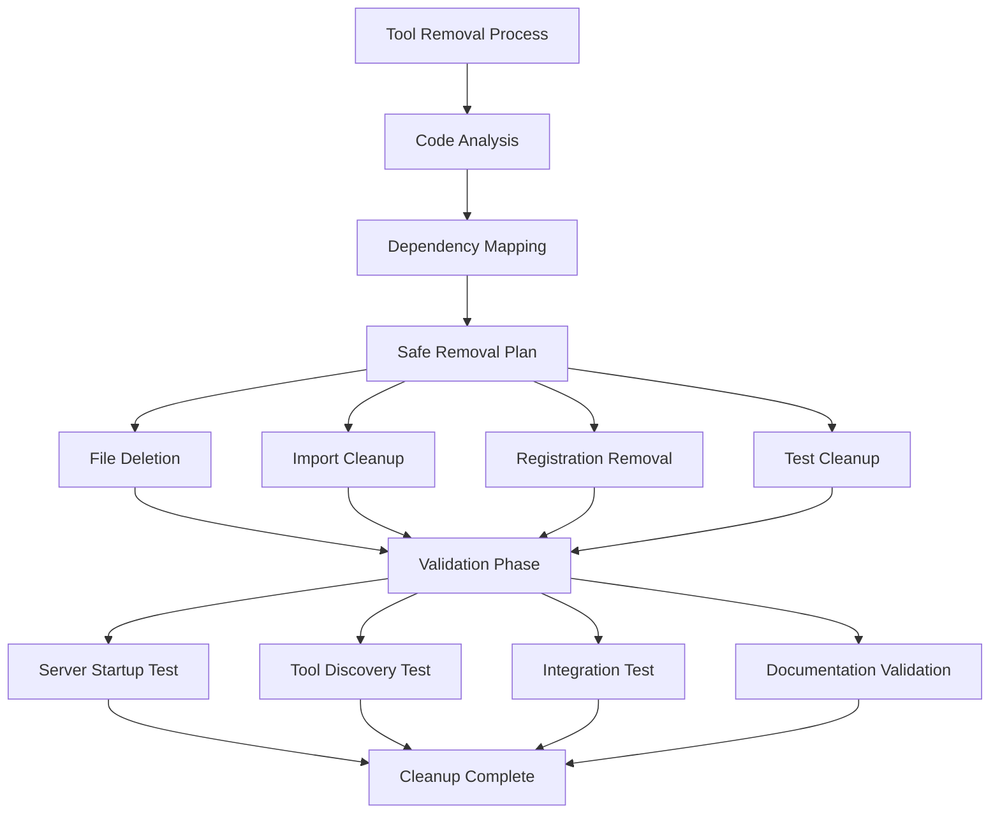
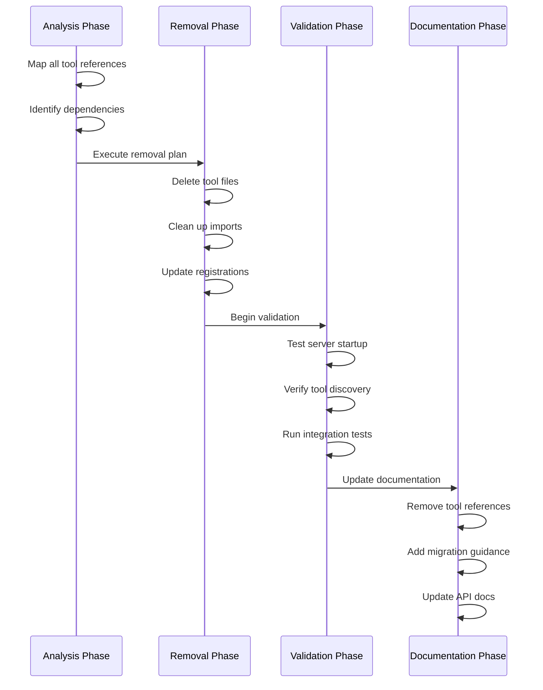
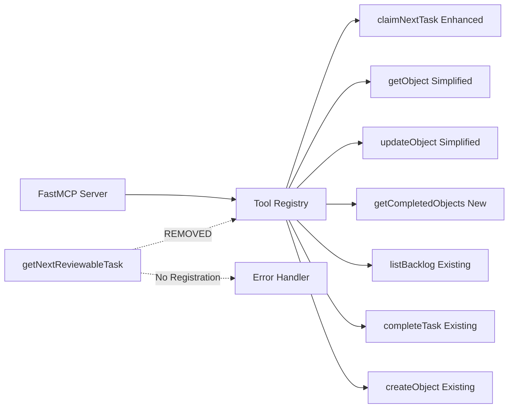

# Tool Management and Cleanup Epic

## Purpose and Goals

Manage the lifecycle of MCP tools by safely removing deprecated functionality and ensuring clean tool registration. This epic focuses on removing the getNextReviewableTask tool completely from the system while maintaining system integrity and updating all related components including server registration, imports, tests, and documentation.

## Major Components and Deliverables

### 1. Safe Tool Removal
- **Complete removal** of getNextReviewableTask tool from MCP server registration
- **Cleanup of implementation files** and associated code modules
- **Import and reference cleanup** throughout the codebase
- **Graceful handling** of any existing dependencies or usage patterns

### 2. Server Registration Updates
- **FastMCP server configuration** updates to remove deprecated tool
- **Tool registry cleanup** to prevent registration of removed tools  
- **Server startup validation** to ensure clean tool initialization
- **Error handling** for any attempts to access removed tools

### 3. Test and Documentation Cleanup
- **Test suite cleanup** to remove tests for deprecated functionality
- **Documentation updates** to remove references to deprecated tools
- **API documentation cleanup** to maintain accurate tool listings
- **Migration guidance** for users transitioning away from deprecated tools

### 4. System Integrity Validation
- **Dependency analysis** to ensure no remaining references to removed tools
- **Integration testing** to validate system works correctly after tool removal
- **Performance validation** to ensure removal doesn't impact other tool performance
- **Error handling verification** for removed tool access attempts

## Detailed Acceptance Criteria

### getNextReviewableTask Tool Removal
- [ ] **Tool File Deletion**: Remove `/src/trellis_mcp/tools/get_next_reviewable_task.py` completely
- [ ] **MCP Registration Removal**: Remove tool from FastMCP server registration in server initialization
- [ ] **Import Cleanup**: Remove all imports and references to getNextReviewableTask throughout codebase
- [ ] **Function Call Cleanup**: Remove any internal usage of getNextReviewableTask functionality
- [ ] **Verification**: Confirm no remaining references to removed tool in entire codebase

### Server Registration and Configuration
- [ ] **FastMCP Tool List**: Update server tool registration to exclude getNextReviewableTask
- [ ] **Server Startup**: Ensure clean server startup without attempting to register removed tool
- [ ] **Tool Discovery**: Verify list_tools() no longer returns getNextReviewableTask
- [ ] **Error Handling**: Implement appropriate error response for attempts to call removed tool
- [ ] **Configuration Validation**: Ensure server configuration remains valid after tool removal

### Test Suite Cleanup
- [ ] **Unit Test Removal**: Remove all unit tests specific to getNextReviewableTask functionality
- [ ] **Integration Test Updates**: Update integration tests that may have used getNextReviewableTask
- [ ] **Test Execution**: Verify all remaining tests pass after tool removal
- [ ] **Coverage Validation**: Ensure test coverage remains comprehensive for remaining tools
- [ ] **Mock Cleanup**: Remove any test mocks or fixtures related to removed tool

### Documentation and API Updates
- [ ] **API Documentation**: Remove getNextReviewableTask from API documentation and examples
- [ ] **User Guides**: Update user guides to remove references to deprecated tool
- [ ] **Migration Documentation**: Provide guidance on alternatives to removed tool
- [ ] **Tool Listings**: Update all tool lists and references in documentation
- [ ] **Change Documentation**: Document the removal in changelog and migration guides

## Technical Architecture

## Integration Points

### With Enhanced Task Claiming Epic
- **Dependency**: Tool removal should occur after enhanced claiming is complete and validated
- **Workflow Impact**: Ensure no claiming workflows depend on getNextReviewableTask functionality
- **Testing Coordination**: Validate enhanced claiming works correctly after tool removal

### With Tool Interface Simplification Epic
- **Sequential Dependency**: Tool removal should happen after interface simplification is stable
- **Error Handling**: Consistent error message patterns for removed vs. simplified tools
- **Documentation**: Coordinate documentation updates across both epics

### With Discovery Tools Implementation Epic
- **Timing**: Tool removal can proceed in parallel with discovery tool implementation
- **Registration**: Ensure new discovery tools are properly registered while removing deprecated tools
- **Testing**: Validate discovery tools work correctly in environment without getNextReviewableTask

## User Stories

### As a System Administrator
- I want deprecated tools completely removed so that the system is clean and maintainable
- I want clear error messages if someone tries to use removed tools so that migration is obvious
- I want comprehensive testing so that tool removal doesn't break other functionality

### As a Developer
- I want clean tool listings so that I only see available, supported tools
- I want updated documentation so that I know which tools are currently available
- I want migration guidance so that I can update my workflows to use alternative tools

### As an API Client
- I want tool discovery to return only valid tools so that my automation doesn't break
- I want clear error responses for removed tools so that I can handle removal gracefully
- I want consistent behavior so that tool removal doesn't affect other tool functionality

## Non-Functional Requirements

### System Integrity Standards
- **Clean removal**: No orphaned references or broken imports after tool removal
- **Server stability**: Server starts and operates normally after tool removal
- **Error handling**: Graceful error responses for attempts to access removed tools
- **Documentation accuracy**: All documentation reflects current tool availability

### Performance Considerations
- **Server startup**: No performance degradation during server initialization after removal
- **Tool discovery**: Faster tool listing due to reduced tool count
- **Memory usage**: Reduced memory footprint from removed tool code
- **Test execution**: Faster test suite execution due to removed test cases

### Maintenance Requirements
- **Code cleanliness**: No dead code or unused imports remaining after removal
- **Dependency hygiene**: No unused dependencies related to removed tool
- **Documentation currency**: All documentation stays current with removed tool status
- **Version compatibility**: Removal doesn't break compatibility with existing clients using other tools

## Architecture Diagrams

### Tool Removal Process Flow

### Server Registration Architecture After Removal

## Testing Strategy

### Removal Validation Testing
- **Reference analysis**: Automated scanning to ensure no remaining references to removed tool
- **Import validation**: Verify all imports are valid and no missing dependencies
- **Registration testing**: Confirm server registers only intended tools
- **Error handling**: Test appropriate error responses for removed tool access attempts

### System Integrity Testing
- **Server startup**: Verify clean server startup after tool removal
- **Tool discovery**: Confirm list_tools() returns only valid, available tools
- **Integration testing**: Validate all remaining tools work correctly after removal
- **Performance testing**: Ensure removal doesn't negatively impact system performance

### Documentation Validation
- **Link checking**: Verify no broken links to removed tool documentation
- **Content accuracy**: Ensure all documentation reflects current tool availability
- **Migration guidance**: Test that migration documentation provides clear alternatives
- **API consistency**: Verify API documentation matches actual available tools

## Success Metrics

### Functional Success
- [ ] **Complete removal**: getNextReviewableTask tool completely removed from system
- [ ] **Clean registration**: Server registers only intended tools without errors
- [ ] **Error handling**: Appropriate error responses for removed tool access attempts
- [ ] **Documentation accuracy**: All documentation reflects current tool availability

### Quality Success
- [ ] **Zero regressions**: No existing functionality broken by tool removal
- [ ] **Clean codebase**: No orphaned code, imports, or references remaining
- [ ] **Test coverage**: Comprehensive test coverage maintained for remaining tools
- [ ] **Documentation quality**: Clear, accurate documentation with migration guidance

### Maintenance Success
- [ ] **Code hygiene**: Clean, maintainable codebase without deprecated tool artifacts
- [ ] **Performance preservation**: No performance degradation from tool removal process
- [ ] **Error clarity**: Clear error messages guide users away from removed functionality
- [ ] **Migration support**: Users have clear guidance on alternatives to removed tool

This epic ensures clean, systematic removal of deprecated functionality while maintaining system integrity and providing clear migration paths for users, resulting in a cleaner, more maintainable MCP server implementation.

### Log

