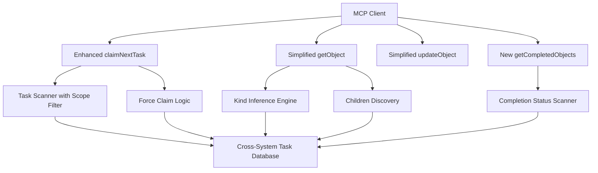

# Trellis MCP Tool Enhancements

## Executive Summary

This project enhances the Trellis MCP server's tool interfaces to improve usability, reduce complexity, and add targeted functionality for task management workflows. The enhancements focus on streamlining tool parameters, adding flexible filtering capabilities, and introducing new discovery features while maintaining backward compatibility and system integrity.

## Functional Requirements

### 1. Tool Removal
- **Remove getNextReviewableTask tool**: Eliminate this tool from the MCP interface as it's no longer needed in the workflow

### 2. Enhanced claimNextTask Tool
- **Add scope filtering**: Enable claiming tasks within specific project/epic/feature boundaries
- **Add specific task claiming**: Allow direct claiming of specific tasks with optional force override
- **Maintain existing functionality**: Preserve current priority-based claiming behavior when no filters are applied

### 3. Simplified Object Tools
- **Remove file_path from responses**: Clean up getObject and updateObject return interfaces
- **Add kind inference**: Automatically determine object type from ID prefixes (P-, E-, F-, T-)
- **Add children listing**: Include immediate child objects in getObject responses

### 4. New Discovery Tool
- **Add getCompletedObjects tool**: Enable discovery of completed objects within a hierarchy branch

## Technical Requirements

### Architecture Overview



### Enhanced claimNextTask Interface

**New Function Signature:**
```python
def claimNextTask(
    projectRoot: str,
    worktree: str = "",
    scope: str = "",
    task_id: str = "",
    force_claim: bool = False,
) -> dict[str, str | dict[str, str]]
```

**Parameters:**
- `projectRoot`: Root directory for planning structure (required)
- `worktree`: Optional worktree identifier (existing)
- `scope`: Optional object ID (P-xxx, E-xxx, F-xxx) to limit task search scope
- `task_id`: Optional specific task ID to claim directly
- `force_claim`: Boolean to bypass prerequisite and status validation when claiming specific task

### Simplified Object Tool Interfaces

**New getObject Signature:**
```python
def getObject(
    id: str,
    projectRoot: str,
) -> dict[str, str | dict[str, str | list[str] | None]]
```

**New updateObject Signature:**
```python
def updateObject(
    id: str,
    projectRoot: str,
    yamlPatch: dict[str, str | list[str] | None] = {},
    bodyPatch: str = "",
    force: bool = False,
) -> dict[str, str | dict[str, str | list[str] | bool]]
```

**Enhanced Return Format (getObject):**
```python
{
    "yaml": dict,           # YAML front-matter
    "body": str,            # Markdown body content
    "kind": str,            # Inferred object kind
    "id": str,              # Clean object ID
    "children": list[str]   # List of immediate child object IDs
}
```

### New getCompletedObjects Tool

**Function Signature:**
```python
def getCompletedObjects(
    id: str,
    projectRoot: str,
) -> dict[str, list[dict[str, str]]]
```

**Return Format:**
```python
{
    "completed_objects": [
        {
            "id": str,
            "kind": str,
            "title": str,
            "completed_date": str,
            "parent": str | None
        },
        ...
    ]
}
```

## Detailed Acceptance Criteria

### 1. getNextReviewableTask Removal
- [ ] **Tool file deletion**: Remove `/src/trellis_mcp/tools/get_next_reviewable_task.py`
- [ ] **MCP registration removal**: Remove tool from FastMCP server registration
- [ ] **Import cleanup**: Remove imports and references throughout codebase
- [ ] **Test cleanup**: Remove associated unit tests
- [ ] **Documentation update**: Remove from API documentation and examples

### 2. claimNextTask Enhancements

#### Scope Filtering
- [ ] **Scope parameter validation**: Accept P-, E-, F- prefixed IDs only
- [ ] **Hierarchical filtering**: Only return tasks that are children (direct or indirect) of scope object
- [ ] **Cross-system compatibility**: Work with both hierarchical and standalone tasks (scope filter won't apply to standalone)
- [ ] **Error handling**: Return meaningful errors for invalid scope IDs
- [ ] **Backward compatibility**: Existing behavior preserved when scope not specified

#### Specific Task Claiming
- [ ] **Task ID parameter**: Accept T- prefixed task IDs or standalone task IDs
- [ ] **Force claim logic**: Skip prerequisite validation when force_claim=True
- [ ] **Status override**: Allow claiming in-progress, review, or done tasks when force_claim=True
- [ ] **Atomic claiming**: Update task status to in-progress atomically
- [ ] **Conflict detection**: Handle concurrent claiming attempts gracefully
- [ ] **Validation**: Return error if task_id doesn't exist

#### Parameter Interaction Rules
- [ ] **Scope + task_id conflict**: Return error if both scope and task_id specified
- [ ] **Force claim validation**: force_claim only applies when task_id is specified
- [ ] **Priority preservation**: When no filters applied, maintain existing priority-based behavior

### 3. Object Tool Simplifications

#### Kind Inference Engine
- [ ] **ID pattern matching**: Automatically detect kind from prefixes (P-=project, E-=epic, F-=feature, T-=task)
- [ ] **Standalone task detection**: Handle task- prefixed standalone tasks
- [ ] **Error handling**: Return clear errors for unrecognized ID patterns
- [ ] **Validation**: Ensure inferred kind matches actual object type

#### file_path Removal
- [ ] **getObject response**: Remove file_path from return dictionary
- [ ] **updateObject response**: Remove file_path from return dictionary
- [ ] **Backward compatibility**: Ensure existing clients handle missing field gracefully
- [ ] **Internal usage**: Update any internal code that relied on file_path in responses

#### Children Discovery
- [ ] **Immediate children only**: Return direct child objects, not recursive
- [ ] **Cross-system support**: Include both hierarchical and standalone children where applicable
- [ ] **Performance optimization**: Efficient scanning without full tree traversal
- [ ] **Sorted results**: Return children in consistent order (by creation date)

### 4. getCompletedObjects Implementation

#### Core Functionality
- [ ] **Recursive scanning**: Find all completed objects in hierarchy branch starting from specified ID
- [ ] **Status filtering**: Only include objects with status='done' 
- [ ] **Cross-system support**: Scan both hierarchical and standalone completed objects
- [ ] **Performance optimization**: Efficient scanning with appropriate caching

#### Return Data Quality
- [ ] **Complete metadata**: Include ID, kind, title, completion date, parent for each object
- [ ] **Timestamp accuracy**: Use actual completion timestamp from object metadata
- [ ] **Sorted results**: Order by completion date (most recent first)
- [ ] **Parent relationships**: Correctly identify parent object for context

### 5. Error Handling & Validation

#### Enhanced Error Messages
- [ ] **Parameter validation**: Clear messages for invalid scope, task_id, or ID formats
- [ ] **Permission errors**: Informative messages when force_claim operations fail
- [ ] **Not found errors**: Specific messages distinguishing object not found vs. access denied
- [ ] **Conflict resolution**: Clear guidance when operations conflict or fail

#### Cross-System Validation
- [ ] **Prerequisite checking**: Validate prerequisites across hierarchical and standalone systems
- [ ] **Circular dependency prevention**: Ensure scope and task relationships remain acyclic
- [ ] **Atomicity**: All multi-step operations either complete fully or roll back cleanly

### 6. Performance Requirements

#### Response Time Targets
- [ ] **claimNextTask with scope**: < 100ms for typical project hierarchies
- [ ] **getObject with children**: < 50ms for objects with moderate child counts
- [ ] **getCompletedObjects**: < 200ms for typical completion histories
- [ ] **Kind inference**: < 10ms for ID pattern matching

#### Scalability Considerations
- [ ] **Large hierarchies**: Efficient performance with 1000+ tasks per project
- [ ] **Concurrent access**: Handle multiple simultaneous claiming attempts
- [ ] **Memory usage**: Reasonable memory footprint for scanning operations
- [ ] **Caching strategy**: Implement appropriate caching for frequently accessed data

### 7. Testing Requirements

#### Unit Test Coverage
- [ ] **New parameter combinations**: Test all claimNextTask parameter scenarios
- [ ] **Kind inference logic**: Comprehensive tests for ID pattern matching
- [ ] **Children discovery**: Test child enumeration for all object types
- [ ] **Completed object scanning**: Test recursive completion discovery
- [ ] **Error conditions**: Test all error paths and edge cases

#### Integration Testing
- [ ] **Cross-system scenarios**: Test scope filtering across hierarchical and standalone tasks
- [ ] **Force claim workflows**: Test override scenarios with various task states
- [ ] **Concurrent operations**: Test multiple clients claiming tasks simultaneously
- [ ] **Data consistency**: Verify system integrity after all operations

#### Backward Compatibility Testing
- [ ] **Existing tool usage**: Ensure existing clients continue working without changes
- [ ] **Response format validation**: Verify removed fields don't break existing consumers
- [ ] **Migration testing**: Test smooth transition from old to new interfaces

## Integration Requirements

### MCP Server Registration
- **Tool removal**: Clean removal of getNextReviewableTask from server tool list
- **Parameter updates**: Register enhanced claimNextTask with new parameter schema
- **New tool addition**: Register getCompletedObjects with appropriate schema
- **Schema validation**: Ensure FastMCP validates new parameter types correctly

### Cross-System Compatibility
- **Hierarchical tasks**: Full support for project/epic/feature/task structure
- **Standalone tasks**: Continued support for standalone task workflows
- **Mixed environments**: Handle projects with both hierarchical and standalone tasks
- **Migration path**: Support for gradually moving between task organization models

## Success Metrics

### Functional Success
- [ ] **Tool removal complete**: getNextReviewableTask cleanly removed without affecting other functionality
- [ ] **Enhanced claiming**: Users can efficiently claim tasks with scope and specific task filters
- [ ] **Simplified interfaces**: getObject and updateObject provide cleaner, more focused responses
- [ ] **Discovery capability**: getCompletedObjects enables effective completion tracking and reporting

### Performance Success
- [ ] **Response time targets met**: All operations complete within specified time limits
- [ ] **Scalability validated**: System handles realistic project sizes efficiently
- [ ] **Resource utilization**: Memory and CPU usage remain reasonable under normal load

### Quality Success
- [ ] **Zero regressions**: No existing functionality broken by changes
- [ ] **Comprehensive testing**: Full test coverage for new and modified functionality
- [ ] **Documentation complete**: All changes documented with examples and usage guidance
- [ ] **Error handling robust**: Clear, actionable error messages for all failure scenarios

## Implementation Phases

### Phase 1: Core Infrastructure
1. Implement kind inference engine
2. Add children discovery to getObject
3. Remove file_path from object tool responses
4. Update tool schemas and registration

### Phase 2: Enhanced Claiming
1. Add scope filtering to claimNextTask
2. Implement specific task claiming with force override
3. Update parameter validation and error handling
4. Comprehensive testing of new claiming features

### Phase 3: Tool Management
1. Remove getNextReviewableTask tool completely
2. Implement getCompletedObjects tool
3. Clean up imports, tests, and documentation
4. Final integration testing and validation

This project enhances the Trellis MCP server's usability while maintaining system integrity and performance, providing more flexible and intuitive interfaces for task management workflows.

### Log

